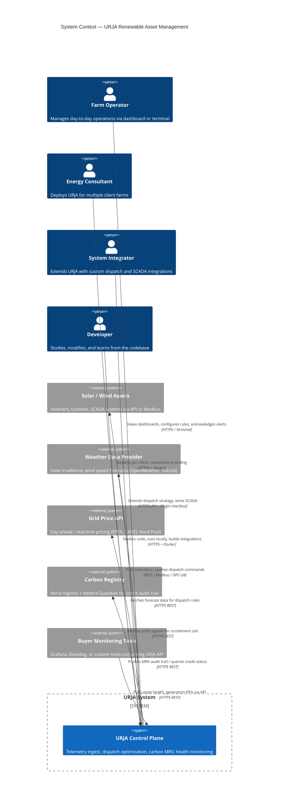
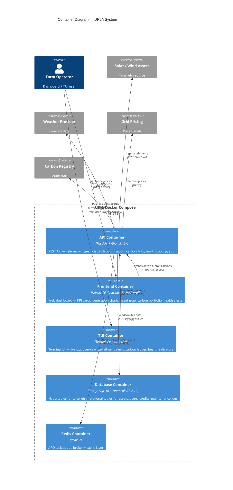
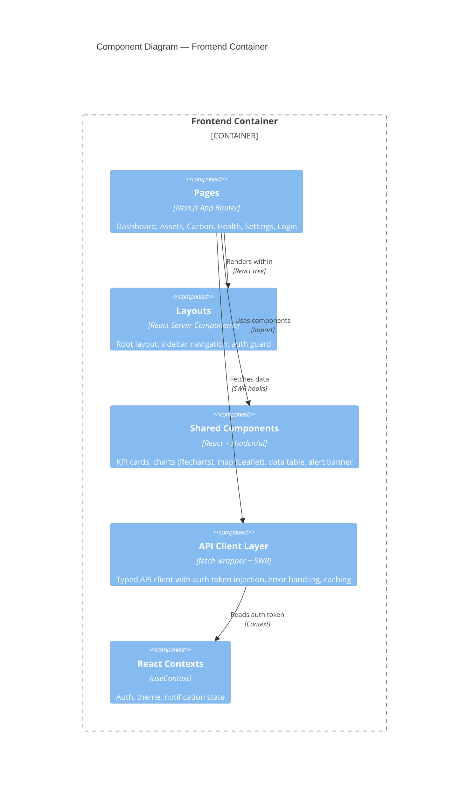
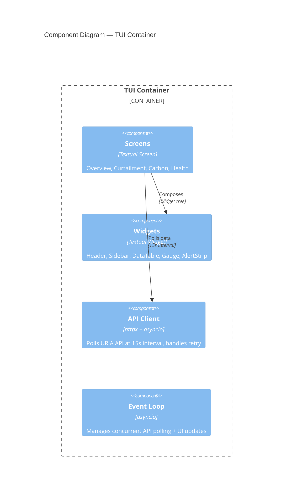
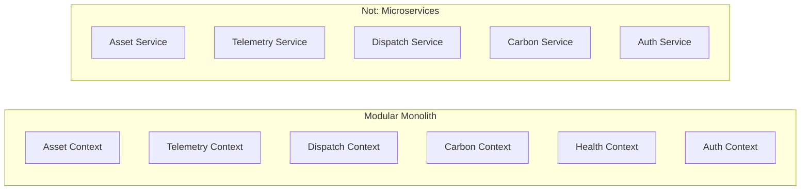
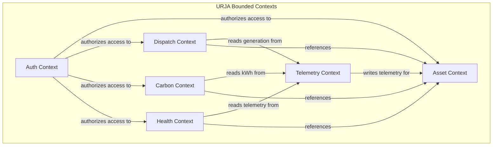
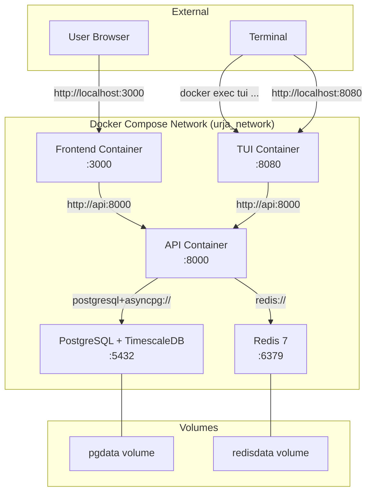

# URJA — System Architecture

**Version**: 1.0
**Author**: Software Architect
**Last Updated**: 2026-07-22

> This document describes the architecture of URJA using C4 model conventions — progressively zooming from system context to component detail. Every decision includes its trade-off.

---

## Table of Contents

1. [System Context (Level 1)](#1-system-context-level-1)
2. [Container Diagram (Level 2)](#2-container-diagram-level-2)
3. [Component Architecture (Level 3)](#3-component-architecture-level-3)
4. [Data Flow Diagrams](#4-data-flow-diagrams)
5. [Key Architectural Decisions](#5-key-architectural-decisions)
6. [Module / Bounded Context Design](#6-module--bounded-context-design)
7. [Security Architecture](#7-security-architecture)
8. [Deployment Architecture](#8-deployment-architecture)

---

## 1. System Context (Level 1)

URJA is a self-hosted boilerplate for renewable asset management. It ingests telemetry from solar/wind assets, computes dispatch optimizations, issues carbon credits, and monitors equipment health — all through a web dashboard and a terminal UI.



### External Actors

| Actor | Type | Interaction |
|-------|------|-------------|
| **Farm Operator** | Human | Views dashboards, monitors alerts, configures dispatch rules |
| **Energy Consultant** | Human | Deploys URJA per client, white-labels branding |
| **System Integrator** | Human | Extends dispatch engine, integrates custom SCADA feeds |
| **Developer** | Human | Studies codebase, builds integrations, develops new modules |
| **Solar/Wind Assets** | External System | Source of telemetry data; target of dispatch commands |
| **Weather API** | External System | Solar irradiance and wind speed forecasts |
| **Grid Pricing API** | External System | Day-ahead and real-time energy pricing signals |
| **Carbon Registry** | External System | Verra-compatible audit trail + Hedera Guardian |
| **Buyer Monitoring Tools** | External System | External observability tools consuming URJA API |

---

## 2. Container Diagram (Level 2)

URJA is a modular monolith composed of five containers running under Docker Compose:



### Container Summary

| Container | Technology | Responsibility | Dependencies |
|-----------|------------|----------------|--------------|
| **API** | FastAPI (Python 3.12+) | REST API, domain logic, background task orchestration | PostgreSQL, Redis |
| **Frontend** | Next.js 16 + Tailwind v4 + shadcn/ui | Web dashboard, Recharts, Leaflet maps | API |
| **TUI** | Textual (Python) | Terminal-based live ops interface | API |
| **Database** | PostgreSQL 16 + TimescaleDB 2.17 | Time-series hypertables + relational data | None |
| **Redis** | Redis 7 | ARQ queue broker + cache | None |

### Container Communication

| From | To | Protocol | Purpose |
|------|----|----------|---------|
| Frontend | API | HTTPS REST (JSON) | All data fetching, mutation, auth |
| TUI | API | HTTPS REST (JSON) | Polls real-time data at 15s interval |
| API | Database | SQL via asyncpg (async) | All persistence |
| API | Redis | Redis protocol via `redis-py` | ARQ queue + cache |
| API | Assets | REST / Modbus / OPC-UA | Telemetry pull, dispatch push |
| API | Weather API | HTTPS REST | Forecast data for dispatch model |
| API | Grid Pricing | HTTPS REST | Day-ahead / real-time pricing |
| API | Carbon Registry | HTTPS REST | MRV audit trail |

---

## 3. Component Architecture (Level 3)

### 3.1 API Container (FastAPI)

```mermaid
C4Component
  title Component Diagram — API Container

  Container_Boundary(api, "API Container") {
    Component(routers, "REST Routers", "FastAPI APIRouter", "Auth, Assets, Telemetry, Dispatch, Carbon, Health — endpoint definitions")
    Component(middleware, "Middleware", "FastAPI Middleware", "Auth JWT verification, API key auth, CORS, request logging, rate limiting")

    Component(services, "Service Layer", "Python Modules", "Business logic — yield_optimizer, carbon_vault, health_scorer")
    Component(tasks, "Task Workers", "ARQ Functions", "Background jobs — telemetry_ingest, carbon_mint, health_scan")

    Component(models, "Data Models", "SQLAlchemy 2.0 + Pydantic v2", "DB models (asset, generation, etc.) + API schemas")
    Component(repos, "Repository Layer", "SQLAlchemy AsyncSession", "Data access abstractions per domain context")

    Component(cache, "Cache Adapter", "redis-py", "Redis read/write for query caching, session store")
    Component(queue, "Queue Adapter", "ARQ", "Background task enqueue/dequeue, retry logic, scheduling")
    Component(clients, "External Clients", "httpx.AsyncClient", "Weather API, grid pricing, carbon registry HTTP clients")
  }

  Rel(routers, middleware, "Passes through", "Request chain")
  Rel(routers, services, "Calls business logic", "Python function calls")
  Rel(services, repos, "Queries persistence", "Async session")
  Rel(services, tasks, "Enqueues background work", "ARQ enqueue")
  Rel(services, clients, "Fetches external data", "HTTPS")
  Rel(repos, models, "Maps to DB schema", "SQLAlchemy ORM")
  Rel(tasks, repos, "Reads/writes data", "Async session")
  Rel(services, cache, "Reads/writes cache", "Redis protocol")
  Rel(workers, cache, "Invalidates cache", "Redis protocol")
```

#### REST Routers

| Router | Base Path | Key Endpoints |
|--------|-----------|---------------|
| `auth` | `/api/v1/auth` | `POST /login`, `POST /refresh`, `POST /logout`, `POST /api-keys` |
| `assets` | `/api/v1/assets` | `GET /`, `GET /{id}`, `POST /`, `PUT /{id}`, `DELETE /{id}`, `GET /{id}/hierarchy` |
| `telemetry` | `/api/v1/telemetry` | `POST /ingest`, `GET /{asset_id}?range=`, `GET /{asset_id}/latest` |
| `dispatch` | `/api/v1/dispatch` | `GET /curtailment`, `POST /rules`, `GET /revenue-lost`, `GET /duck-curve` |
| `carbon` | `/api/v1/carbon` | `GET /credits`, `POST /mint`, `GET /audit-trail`, `GET /portfolio`, `POST /export` |
| `health` | `/api/v1/health` | `GET /scores`, `GET /alerts`, `POST /alerts/{id}/acknowledge`, `GET /maintenance` |
| `settings` | `/api/v1/settings` | `GET /`, `PUT /`, `GET /branding` |

#### Service Layer

| Service | Responsibility | Key Functions |
|---------|---------------|---------------|
| `yield_optimizer` | Curtailment detection, revenue calculation, dispatch rules engine | `detect_curtailment()`, `calculate_revenue_lost()`, `optimize_dispatch()`, `generate_duck_curve()` |
| `carbon_vault` | Carbon credit calculation, MRV pipeline, audit trail generation | `calculate_co2_eq()`, `create_credit()`, `build_audit_record()`, `export_esg_report()` |
| `health_scorer` | Anomaly detection, health scoring, maintenance scheduling | `compute_health_score()`, `detect_anomalies()`, `schedule_maintenance()`, `evaluate_thresholds()` |

#### Task Workers (ARQ)

| Task | Trigger | Work Done | Frequency |
|------|---------|-----------|-----------|
| `telemetry_ingest` | `POST /telemetry/ingest` | Validate, enrich, insert into hypertable, invalidate cache | On each ingest |
| `carbon_mint` | `POST /carbon/mint` | Calculate CO2 eq, create credit record, push audit trail to registry | On demand |
| `health_scan` | Cron schedule (every 15 min) | Fetch recent telemetry, compute anomaly scores, create alerts | Interval |
| `refresh_weather` | Cron schedule (every 6 hr) | Pull latest forecast data, update dispatch model inputs | Interval |
| `refresh_pricing` | Cron schedule (every 1 hr) | Pull latest grid pricing, update revenue calculations | Interval |
| `daily_rollup` | Cron schedule (daily) | Compute daily/hourly continuous aggregate rollups | Interval |

### 3.2 Frontend Container (Next.js 16)



#### Pages

| Route | Module | Key Components |
|-------|--------|----------------|
| `/` | Dashboard | GenerationKPI (x6), DuckCurveChart, AssetMapMini, AlertTicker |
| `/assets` | Assets | AssetTable, AssetDetail, AssetHierarchyTree, InverterMap |
| `/assets/{id}` | Assets | GenerationCurve, CurtailmentTimeline, HealthGauge, SOCGauge |
| `/yield` | Dispatch | RevenueLostCard, DuckCurveChart, DispatchRuleEditor, WhatIfSlider |
| `/carbon` | Carbon | CreditPortfolioTable, MintCreditForm, AuditTrailTimeline, ESGReportExport |
| `/health` | Health | HealthScoreGrid, AlertList, AnomalyChart, MaintenanceScheduler |
| `/settings` | Settings | BrandingEditor, ThresholdConfig, APIKeyManager, UserProfile |
| `/login` | Auth | LoginForm |

#### Shared Components

| Component | Source | Used In |
|-----------|--------|---------|
| `KpiCard` | shadcn/ui + custom | All pages — large number display |
| `GenerationChart` | Recharts (AreaChart) | Dashboard, Asset detail |
| `DuckCurveChart` | Recharts (ComposedChart) | Dashboard, Dispatch |
| `HealthGauge` | Custom SVG gauge | Asset detail, Health |
| `AssetMap` | react-leaflet | Dashboard, Assets |
| `DataTable` | shadcn/ui (Table) | Carbon, Health, Assets |
| `AlertBanner` | shadcn/ui (Alert) | All pages — floating notifications |
| `Skeleton` | shadcn/ui (Skeleton) | All pages — loading states |

### 3.3 TUI Container (Textual)



#### Screens

| Screen | Key Widgets | Data Source |
|--------|-------------|-------------|
| **Overview** | DataTable (live MW gen), Header (stats row), AlertStrip (top 5) | `GET /telemetry/latest`, `GET /health/alerts?limit=5` |
| **Curtailment** | DataTable (events), Static (revenue lost), RichLog (dispatch log) | `GET /dispatch/curtailment`, `GET /dispatch/revenue-lost` |
| **Carbon** | DataTable (last 10 credits), Static (portfolio totals) | `GET /carbon/credits?limit=10`, `GET /carbon/portfolio` |
| **Health** | DataTable (asset scores), Static (active alerts count) | `GET /health/scores`, `GET /health/alerts?status=active` |

---

## 4. Data Flow Diagrams

### 4.1 Telemetry Ingestion Flow

```
Solar/Wind Asset  ──HTTP/Modbus──►  POST /api/v1/telemetry/ingest
                                          │
                                          ▼
                                    API Router
                                          │
                                    Validate payload (Pydantic)
                                          │
                                          ▼
                                    Service Layer
                                          │
                                    Enrich (add asset_id, timestamp)
                                          │
                                    ┌─────┴──────┐
                                    │            │
                                    ▼            ▼
                              ARQ Enqueue    TimescaleDB
                              (async ingest)  Hypertable
                                    │
                                    ▼
                              ARQ Worker
                              telemetry_ingest
                                    │
                              Insert batch into
                              hypertable, invalidate cache
```

**Key properties:**
- Ingest endpoint accepts single and batch (up to 1000) records
- Validation at API layer (Pydantic schema) returns 422 on malformed data
- Enqueue to ARQ for non-blocking writes — API responds 202 Accepted immediately
- Worker validates unit consistency (kW, kWh, °C, etc.) before insert
- Continuous aggregates pre-compute hourly/daily rollups automatically

### 4.2 Curtailment Detection Flow

```
Telemetry Data (generation_kw, timestamp per asset)
         │
         ▼
Yield Service ───► Fetch grid price (from DB or external API)
         │
         ▼
Compare actual generation vs. expected (from irradiance model or historical baseline)
         │
    ┌────┴────┐
    │         │
  Below     Normal
  Threshold
    │
    ▼
Detect curtailment event
    │
    ▼
Calculate revenue_lost = curtailed_kwh × grid_price_per_kwh
    │
    ▼
Update curtailment_event table
    │
    ▼
Check dispatch rules (battery SOC, compute load availability)
    │
    ▼
Optimize: if battery available → schedule charging
           if compute load → route excess
    │
    ▼
Create DispatchDecision record
```

**Key properties:**
- Expected generation computed from asset capacity × irradiance forecast (or last 30-day rolling baseline)
- Detection window: configurable (default 15-minute intervals, 3 consecutive = confirmed event)
- Revenue lost uses configurable tariff rate per asset (stored in DB)
- Duck curve: overlay of generation, grid price, and curtailment on 24-hour timeline

### 4.3 Carbon Credit Flow

```
kWh Generation Data (from hypertable, filtered by date range)
         │
         ▼
Carbon Service ───► Fetch asset metadata (type, location, methodology)
         │
         ▼
Apply IPMVP methodology: CO2_eq = kWh_generated × emission_factor
   (emission_factor from regional grid mix, configurable per asset)
         │
         ▼
Create CarbonCredit record (status: pending)
         │
         ▼
Build MRV audit record:
   - Generation batch ID range
   - Total kWh, CO2_eq, methodology version
   - Timestamp, asset credentials
         │
         ▼
Push audit trail to Verra-compatible registry (or Hedera Guardian)
         │
    ┌────┴────┐
    │         │
  Success   Failure
    │         │
    ▼         ▼
  Credit    Credit
  issued    failed
  (status:  (status:
  active)   retry)
    │
    ▼
Update CarbonCredit record in DB
```

**Key properties:**
- Emission factors stored per region, configurable
- Methodology version tracked in each credit record for auditability
- Hedera Guardian integration: creates Verra-compatible Verifiable Credentials
- Export ESG report (PDF) generated server-side from credit portfolio
- Manual "Mint Credits" action by operator (not automatic)

### 4.4 Health Scoring Flow

```
Telemetry Data (15-min windows per asset)
         │
    Fetch last N readings
         │
         ▼
Health Service ───► Statistical anomaly detection
                         │
                    z-score = (value - mean) / std_dev
                         │
                    ┌────┴────┐
                    │         │
                 Normal   |z-score| > threshold
                    │         │
                    │         ▼
                    │    Create Alert record
                    │    (asset_id, metric, observed, expected, deviation %)
                    │         │
                    │    ┌────┴───┐
                    │    │        │
                    │  Active   Warning
                    │  (z>3)    (z>2)
                    │    │        │
                    └────┴────────┘
                         │
                         ▼
              Compute health_score = weighted average of
              all metric scores (0–100%)
                         │
                         ▼
              Update asset health_score in DB
                         │
                         ▼
              Check maintenance schedule:
              if score < threshold → suggest work order
```

**Key properties:**
- Metrics monitored: power output (kW), temperature (°C), voltage (V), vibration (wind)
- v1 uses z-score statistical method (no ML dependency)
- Pro tier: LSTM/XGBoost models for predictive failure forecasting
- Alert thresholds configurable per asset group (settings API)
- Health score is a 0–100% composite across all monitored metrics
- Maintenance scheduler generates suggested work orders from alert patterns

---

## 5. Key Architectural Decisions

### ADR-1: FastAPI over Django / Express

| | FastAPI | Django | Express |
|--|---------|--------|---------|
| **Async native** | ✅ Built-in | ❌ Async added later | ✅ Callback-based |
| **Auto OpenAPI docs** | ✅ Pydantic v2 | ❌ DRF-YASG | ❌ Swagger-jsdoc |
| **Type safety** | ✅ Pydantic | ❌ Serializer | ❌ Manual |
| **Energy domain adoption** | ✅ Growing | ✅ Mature | ❌ Low |

**Decision:** FastAPI.
**Trade-off:** Smaller ecosystem than Django but async-native design pairs perfectly with ARQ + asyncpg for time-series workloads. Auto-generated OpenAPI docs reduce documentation burden — critical for a boilerplate buyers need to integrate with.

### ADR-2: TimescaleDB over InfluxDB

| | TimescaleDB | InfluxDB |
|--|-------------|----------|
| **Query language** | Full SQL | Flux (proprietary) |
| **Relational data** | ✅ Same DB | ❌ Separate bucket |
| **Continuous aggregates** | ✅ Built-in | ✅ Tasks (limited) |
| **Ecosystem** | PostgreSQL ecosystem | Influx-specific |
| **Learning curve** | Low (SQL) | Medium (Flux) |

**Decision:** TimescaleDB.
**Trade-off:** Slightly higher memory footprint per row (~20% more than InfluxDB) but eliminates the need for a second database for relational data (assets, users, credits, maintenance). One DB to learn, one DB to back up, one connection pool. PostgreSQL ecosystem (pgAdmin, extensions, tooling) is a force multiplier for boilerplate buyers.

### ADR-3: ARQ over Celery

| | ARQ | Celery |
|--|-----|--------|
| **Runtime** | asyncio-native | thread/multiprocess |
| **Broker** | Redis only | Redis, RabbitMQ, SQS |
| **Dependencies** | redis-py only | celery + broker lib |
| **Memory** | ~5MB per worker | ~50MB per worker |
| **Community** | Small | Large |
| **Cron support** | Built-in | Via beat/scheduler |

**Decision:** ARQ.
**Trade-off:** Smaller community and fewer integrations than Celery, but runs purely on Redis (already in the stack), is asyncio-native (matches FastAPI), and is dramatically lighter on CPU-bound hardware (Latitude 3460 constraint). The boilerplate audience runs on single servers — ARQ's simplicity wins over Celery's feature depth.

### ADR-4: Modular Monolith (No Microservices)



**Decision:** Modular monolith with clear bounded contexts.
**Trade-off:** Cannot scale individual modules independently (not needed — target audience is single-server deployments). Gains: zero network overhead between contexts, single deployment unit, simpler debugging, faster development velocity. Each context remains swappable — a buyer _can_ replace the dispatch module without touching carbon.

### ADR-5: JWT Auth (Stateless)

**Decision:** JWT access tokens (15 min expiry) + refresh tokens (7 day expiry) + API key support for M2M.
**Trade-off:** No server-side session store needed — simpler deployment for buyers. Cannot revoke individual JWTs before expiry (short TTL mitigates). API keys are long-lived but scoped to specific roles and logged for audit. Refresh tokens stored in DB as a revocation list option.

### ADR-6: Docker Compose over Kubernetes

**Decision:** Docker Compose.
**Trade-off:** No auto-scaling, no rolling updates, no service mesh. Target buyers deploy on single VPS or on-prem server — Kubernetes is overkill and expensive. Docker Compose is a single `docker compose up -d` with five containers. For buyers who need HA, the architecture is simple enough to port to Docker Swarm or Nomad with minimal changes. Enterprise tier consulting call covers this migration.

### ADR-7: Polling over WebSockets (v1)

**Decision:** Frontend polls API at 15s interval; TUI also polls at 15s.
**Trade-off:** Higher API load than push-based (WebSocket/SSE). Acceptable for v1 because (a) target audience is <50 assets generating ~200 requests/hour, (b) polling is simpler to implement and debug, (c) the API response is cached in Redis for the polling interval. WebSocket/SSE upgrade is a documented v2 roadmap item.

### ADR-8: Leaflet over Google Maps

**Decision:** react-leaflet with OpenStreetMap tiles.
**Trade-off:** Fewer built-in features than Google Maps (no Street View, no Places API). But: zero API key requirement, works offline (tile caching), free at scale. For an asset monitoring dashboard showing inverter locations on a solar farm, Leaflet is sufficient. If a buyer needs satellite imagery, they can swap tile providers.

---

## 6. Module / Bounded Context Design



### 6.1 Asset Context

| Element | Description |
|---------|-------------|
| **Entities** | `Organization`, `Asset`, `AssetGroup`, `AssetHierarchy`, `Inverter`, `Turbine`, `Battery` |
| **Aggregate Root** | `Asset` |
| **Key Tables** | `assets`, `asset_groups`, `asset_hierarchy`, `asset_config` |
| **Responsibilities** | CRUD for assets and hierarchy, organization assignment, configuration storage |
| **Dependencies** | Auth context (tenant isolation) |
| **Events** | `AssetCreated`, `AssetConfigured`, `AssetDecommissioned` |
| **Owner** | Backend |

### 6.2 Telemetry Context

| Element | Description |
|---------|-------------|
| **Entities** | `TelemetryReading`, `TelemetryBatch`, `AggregateHourly`, `AggregateDaily` |
| **Aggregate Root** | `TelemetryReading` (time-series, no aggregate root in classic sense) |
| **Key Tables** | `telemetry_readings` (hypertable), `telemetry_batches`, `telemetry_audit` |
| **Responsibilities** | Ingest, validate, store time-series generation data; compute continuous aggregates |
| **Dependencies** | Asset context (validates asset_id exists on ingest) |
| **Events** | `TelemetryIngested`, `BatchProcessed` |
| **Owner** | Backend |

### 6.3 Dispatch Context

| Element | Description |
|---------|-------------|
| **Entities** | `CurtailmentEvent`, `DispatchDecision`, `DispatchRule`, `RevenueLost` |
| **Aggregate Root** | `CurtailmentEvent` |
| **Key Tables** | `curtailment_events`, `dispatch_decisions`, `dispatch_rules`, `revenue_snapshots` |
| **Responsibilities** | Curtailment detection, revenue calculation, dispatch optimization, what-if analysis |
| **Dependencies** | Telemetry context (reads generation), Asset context (reads battery SOC/config) |
| **Events** | `CurtailmentDetected`, `DispatchExecuted`, `RevenueRecalculated` |
| **Owner** | Backend |
| **Plugins** | `BaseDispatchStrategy` interface — buyers can replace default optimization |

### 6.4 Carbon Context

| Element | Description |
|---------|-------------|
| **Entities** | `CarbonCredit`, `CarbonMethodology`, `AuditRecord`, `CreditPortfolio` |
| **Aggregate Root** | `CarbonCredit` |
| **Key Tables** | `carbon_credits`, `carbon_methodologies`, `carbon_audit_trail`, `carbon_portfolios`, `esg_reports` |
| **Responsibilities** | CO2 eq calculation, credit issuance, MRV audit trail, ESG report export |
| **Dependencies** | Telemetry context (reads kWh generation), Asset context (reads asset metadata) |
| **Events** | `CreditMinted`, `CreditRetired`, `AuditTrailPushed` |
| **Owner** | Backend |

### 6.5 Health Context

| Element | Description |
|---------|-------------|
| **Entities** | `HealthScore`, `Alert`, `AnomalyEvent`, `MaintenanceWorkOrder` |
| **Aggregate Root** | `Alert` |
| **Key Tables** | `health_scores`, `alerts`, `anomaly_events`, `maintenance_work_orders`, `alert_thresholds` |
| **Responsibilities** | Anomaly detection, health scoring, alert management, maintenance scheduling |
| **Dependencies** | Telemetry context (reads recent readings), Asset context (reads asset config) |
| **Events** | `AnomalyDetected`, `AlertCreated`, `AlertAcknowledged`, `WorkOrderGenerated` |
| **Owner** | Backend |

### 6.6 Auth Context

| Element | Description |
|---------|-------------|
| **Entities** | `User`, `Organization`, `ApiKey`, `Role`, `Permission` |
| **Aggregate Root** | `User` |
| **Key Tables** | `users`, `organizations`, `api_keys`, `roles`, `user_roles`, `role_permissions` |
| **Responsibilities** | Authentication (JWT), authorization (RBAC), API key management, multi-tenant data isolation |
| **Dependencies** | None (foundational context) |
| **Events** | `UserLoggedIn`, `ApiKeyCreated`, `RoleAssigned` |
| **Owner** | Backend |

### Context Dependency Graph

```
Auth ⊗ (all contexts) — authorization boundary
   │
   └─► Asset — asset registry
         │
         ├─► Telemetry — readings time-series
         │     │
         │     ├─► Dispatch — curtailment detection + optimization
         │     │
         │     └─► Carbon — credit calculation
         │
         └─► Health — anomaly detection
```

---

## 7. Security Architecture

### 7.1 Authentication

| Method | Use Case | Implementation |
|--------|----------|----------------|
| **JWT Access Token** | Web dashboard sessions | Signed with HS256, 15 min TTL, stored in memory (frontend) |
| **JWT Refresh Token** | Session extension | Signed with HS256, 7 day TTL, stored in httpOnly cookie |
| **API Key** | M2M (SCADA, external tools) | Pre-generated UUID v4, SHA-256 hash stored in DB, key prefix for identification |

**Token structure (JWT):**
```json
{
  "sub": "user_abc123",
  "org": "org_xyz789",
  "roles": ["admin"],
  "iat": 1712345678,
  "exp": 1712346578
}
```

### 7.2 Authorization (RBAC)

| Role | Scope | Allowed Actions |
|------|-------|-----------------|
| **admin** | Organization-wide | Full CRUD on all modules, user management, API key management, dispatch rules, settings |
| **operator** | Organization-wide | View all, acknowledge alerts, export reports, run dispatch optimization |
| **viewer** | Organization-wide | View-only access to all dashboards and exports |

Permission model: `{action}:{resource}` (e.g., `read:telemetry`, `write:dispatch_rules`).

### 7.3 Multi-Tenant Data Isolation

- Every table includes an `organization_id` column with a composite index.
- All repository queries filter by `organization_id` via middleware-injected context (extracted from JWT or API key).
- No cross-organization data access possible at database level — enforced at service layer.
- Tenant isolation is **by design** even though URJA is self-hosted: a buyer operating multiple farms can create separate organizations within a single instance, or deploy separate instances. Both patterns are supported.

### 7.4 API Security

| Measure | Implementation |
|---------|----------------|
| **CORS** | Restricted to configured frontend origin(s) |
| **Rate limiting** | Per-IP and per-API-key rate limits (configurable, default 100 req/min) |
| **Request validation** | Pydantic schemas reject malformed payloads at router boundary |
| **SQL injection** | Parameterized queries via SQLAlchemy ORM (no raw SQL concatenation) |
| **Secrets** | All secrets (DB password, JWT secret, API keys) via environment variables, never hardcoded |
| **HTTPS** | Docker Compose includes Caddy/Traefik reverse proxy for TLS termination (documented, optional) |

### 7.5 Data Privacy

- Telemetry data is not logged at DEBUG level (avoids PII leakage in logs).
- Export reports exclude individual inverter locations unless explicitly requested.
- No tracking, no telemetry, no external analytics calls from the boilerplate itself.

---

## 8. Deployment Architecture

### 8.1 Docker Compose Services

```yaml
services:
  api:        # FastAPI application
  db:         # PostgreSQL 16 + TimescaleDB
  redis:      # Redis 7
  frontend:   # Next.js 16
  tui:        # Textual application
```



### 8.2 Service Specifications

| Service | Image | Ports | Dependencies |
|---------|-------|-------|--------------|
| **db** | `timescale/timescaledb:2.17-pg16` | `5432` | None |
| **redis** | `redis:7-alpine` | `6379` | None |
| **api** | Built from `./backend/Dockerfile` | `8000` | db, redis |
| **frontend** | Built from `./frontend/Dockerfile` | `3000` | api |
| **tui** | Built from `./dashboard-tui/Dockerfile` | `8080` | api |

### 8.3 Environment Variables

#### Database
```
POSTGRES_DB=urja
POSTGRES_USER=urja
POSTGRES_PASSWORD=<secret>
```

#### API (Backend)
```
DATABASE_URL=postgresql+asyncpg://urja:<secret>@db:5432/urja
REDIS_URL=redis://redis:6379/0
JWT_SECRET=<secret>
JWT_ACCESS_EXPIRE_MINUTES=15
JWT_REFRESH_EXPIRE_DAYS=7
CORS_ORIGINS=http://localhost:3000
LOG_LEVEL=INFO
```

#### Frontend
```
NEXT_PUBLIC_API_URL=http://api:8000/api/v1
NEXT_PUBLIC_MAP_TILE_URL=https://{s}.tile.openstreetmap.org/{z}/{x}/{y}.png
```

#### TUI
```
URJA_API_URL=http://api:8000/api/v1
URJA_POLL_INTERVAL=15
```

### 8.4 Volume Mounts

| Volume | Container Path | Purpose |
|--------|---------------|---------|
| `pgdata` | `/var/lib/postgresql/data` | Persistent database storage |
| `redisdata` | `/data` | Persistent Redis data (RDB/AOF) |

### 8.5 Network Configuration

- All containers on a shared bridge network `urja_network`
- Only frontend port `3000` and TUI port `8080` exposed to host
- Database port `5432` and Redis port `6379` internal to the network only
- API port `8000` internal (accessible to frontend and TUI via Docker DNS)

### 8.6 Health Checks

| Service | Check | Interval |
|---------|-------|----------|
| **db** | `pg_isready -U urja` | 10s |
| **redis** | `redis-cli ping` | 10s |
| **api** | `curl -f http://localhost:8000/health` | 15s |
| **frontend** | `curl -f http://localhost:3000` | 15s |

### 8.7 Resource Requirements

| Service | Min Memory | Recommended |
|---------|-----------|-------------|
| **db** | 512 MB | 1 GB |
| **redis** | 64 MB | 128 MB |
| **api** | 256 MB | 512 MB |
| **frontend** | 128 MB | 256 MB |
| **tui** | 64 MB | 128 MB |
| **Total** | ~1 GB | ~2 GB |

---

## Appendix A: Trade-Off Summary

| Decision | Chosen | Rejected | Key Trade-Off |
|----------|--------|----------|---------------|
| Framework | FastAPI | Django, Express | Smaller ecosystem vs. async-native + auto-docs |
| Time-series DB | TimescaleDB | InfluxDB | Higher memory per row vs. full SQL + single DB |
| Task queue | ARQ | Celery | Smaller community vs. lighter + asyncio-native |
| Architecture | Modular monolith | Microservices | No independent scaling vs. simpler deployment |
| Auth | JWT + API keys | Session-based | No server revocation vs. stateless simplicity |
| Deployment | Docker Compose | Kubernetes | No HA/auto-scaling vs. single-command deploy |
| Real-time updates | Polling (15s) | WebSocket/SSE | Higher request load vs. simpler implementation |
| Maps | Leaflet | Google Maps | Fewer features vs. free + offline-capable |
| ML models | Statistical (v1) | LSTM/XGBoost | Lower accuracy vs. no ML infra dependency |

## Appendix B: Related Documents

- [PRD.md](../product/PRD.md) — Product Requirements Document
- [API.md](API.md) — API Reference (auto-generated from OpenAPI)
- [DATABASE.md](DATABASE.md) — Database Schema Documentation
- [DEPLOYMENT.md](DEPLOYMENT.md) — Deployment Guide
