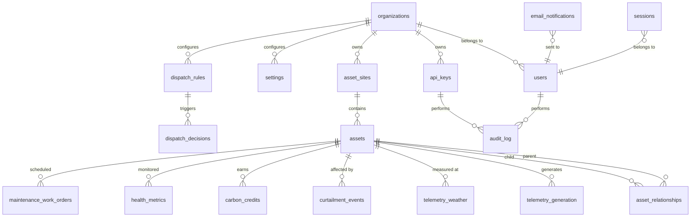

# URJA — Database Schema & TimescaleDB Configuration

**Version**: 1.0
**Author**: Database Optimizer
**Last Updated**: 2026-07-22
**Engine**: PostgreSQL 16 + TimescaleDB 2.17

> This document defines the complete schema for the URJA renewable asset management boilerplate. Every decision — from chunk intervals to index ordering — has a stated rationale. Read this before writing any migration or query.

---

## Table of Contents

1. [Entity Relationship Overview](#1-entity-relationship-overview)
2. [Table Definitions](#2-table-definitions)
   - [Core Relational Tables](#21-core-relational-tables)
   - [TimescaleDB Hypertables](#22-timescaledb-hypertables)
   - [Supporting Tables](#23-supporting-tables)
3. [TimescaleDB Hypertable Configuration](#3-timescaledb-hypertable-configuration)
4. [Indexing Strategy](#4-indexing-strategy)
5. [Common Query Patterns & Continuous Aggregates](#5-common-query-patterns--continuous-aggregates)
6. [Migration Strategy](#6-migration-strategy)
7. [Seed Data Structure](#7-seed-data-structure)

---

## 1. Entity Relationship Overview



---

## 2. Table Definitions

### 2.1 Core Relational Tables

#### 2.1.1 `organizations`

Multi-tenant entities. Every row in the system is scoped to an organization. Even though URJA is self-hosted, this enables a single instance to manage multiple farms independently.

```sql
CREATE TABLE organizations (
    id              UUID PRIMARY KEY DEFAULT gen_random_uuid(),
    name            TEXT NOT NULL,
    slug            TEXT NOT NULL UNIQUE,
    logo_url        TEXT,
    timezone        TEXT NOT NULL DEFAULT 'UTC',
    currency        TEXT NOT NULL DEFAULT 'USD',
    emission_factor NUMERIC(8,4) NOT NULL DEFAULT 0.92
                    CHECK (emission_factor >= 0),
    is_active       BOOLEAN NOT NULL DEFAULT TRUE,
    metadata        JSONB DEFAULT '{}',
    created_at      TIMESTAMPTZ NOT NULL DEFAULT now(),
    updated_at      TIMESTAMPTZ NOT NULL DEFAULT now()
);

CREATE INDEX idx_organizations_slug ON organizations (slug);
CREATE INDEX idx_organizations_active ON organizations (is_active) WHERE is_active = TRUE;
```

**Columns:**
| Column | Type | Purpose |
|--------|------|---------|
| `id` | UUID | Primary key, generated client-safe |
| `name` | TEXT | Human-readable company/farm name |
| `slug` | TEXT | URL-friendly identifier for API paths |
| `logo_url` | TEXT | White-label branding |
| `timezone` | TEXT | Farm timezone for display (e.g. `America/Los_Angeles`) |
| `currency` | TEXT | ISO 4217 currency code for revenue display |
| `emission_factor` | NUMERIC(8,4) | tCO2e per MWh for carbon calculations |
| `is_active` | BOOLEAN | Soft delete / deactivation |
| `metadata` | JSONB | Extensible metadata for buyer custom fields |
| `created_at` | TIMESTAMPTZ | Row creation timestamp |
| `updated_at` | TIMESTAMPTZ | Row last-modified timestamp |

**Query pattern:** `WHERE id = :org_id` on every query in the system. Never queried without exact ID or slug match.

---

#### 2.1.2 `users`

Human users with role-based access. Passwords are hashed with bcrypt; never stored in plaintext.

```sql
CREATE TYPE user_role AS ENUM ('admin', 'operator', 'viewer');

CREATE TABLE users (
    id                UUID PRIMARY KEY DEFAULT gen_random_uuid(),
    organization_id   UUID NOT NULL REFERENCES organizations(id) ON DELETE CASCADE,
    email             TEXT NOT NULL,
    password_hash     TEXT NOT NULL,
    display_name      TEXT NOT NULL,
    role              user_role NOT NULL DEFAULT 'viewer',
    is_active         BOOLEAN NOT NULL DEFAULT TRUE,
    email_verified_at TIMESTAMPTZ,
    last_login_at     TIMESTAMPTZ,
    created_at        TIMESTAMPTZ NOT NULL DEFAULT now(),
    updated_at        TIMESTAMPTZ NOT NULL DEFAULT now(),

    CONSTRAINT uq_users_org_email UNIQUE (organization_id, email)
);

CREATE INDEX idx_users_organization_id ON users (organization_id);
CREATE INDEX idx_users_email ON users (email);
```

**Columns:**
| Column | Type | Purpose |
|--------|------|---------|
| `id` | UUID | Primary key |
| `organization_id` | UUID | FK → organizations — tenant isolation |
| `email` | TEXT | Login identifier; unique per org |
| `password_hash` | TEXT | bcrypt hash (never raw password) |
| `display_name` | TEXT | Human name for UI |
| `role` | user_role | RBAC level |
| `is_active` | BOOLEAN | Soft disable without data loss |
| `email_verified_at` | TIMESTAMPTZ | Null until verified |
| `last_login_at` | TIMESTAMPTZ | For audit and stale-account detection |
| `created_at` | TIMESTAMPTZ | |
| `updated_at` | TIMESTAMPTZ | |

**Query patterns:**
- `WHERE email = :email AND organization_id = :org_id` — login lookup
- `WHERE organization_id = :org_id ORDER BY created_at DESC` — user listing
- `SELECT id, email, role FROM users WHERE id = :id` — session identity

---

#### 2.1.3 `api_keys`

Machine-to-machine authentication. SCADA integrations, external monitoring tools, and automation scripts use API keys.

```sql
CREATE TYPE api_key_scope AS ENUM ('read', 'write', 'admin');

CREATE TABLE api_keys (
    id                UUID PRIMARY KEY DEFAULT gen_random_uuid(),
    organization_id   UUID NOT NULL REFERENCES organizations(id) ON DELETE CASCADE,
    key_prefix        TEXT NOT NULL,
    key_hash          TEXT NOT NULL UNIQUE,
    name              TEXT NOT NULL,
    scope             api_key_scope NOT NULL DEFAULT 'read',
    expires_at        TIMESTAMPTZ,
    last_used_at      TIMESTAMPTZ,
    is_active         BOOLEAN NOT NULL DEFAULT TRUE,
    created_at        TIMESTAMPTZ NOT NULL DEFAULT now(),

    CONSTRAINT uq_api_keys_name_org UNIQUE (organization_id, name)
);

CREATE INDEX idx_api_keys_organization_id ON api_keys (organization_id);
CREATE INDEX idx_api_keys_key_hash ON api_keys (key_hash);
CREATE INDEX idx_api_keys_active ON api_keys (is_active, expires_at)
    WHERE is_active = TRUE;
```

**Why key_prefix + key_hash:**
- `key_prefix` is the first 8 characters (e.g. `urja_abc12`) shown in UI so operators know which key is which.
- `key_hash` is SHA-256 of the full key. The raw key is shown **once** on creation, then irrecoverable.

**Query pattern:** `WHERE key_hash = sha256(:raw_key) AND is_active = TRUE AND (expires_at IS NULL OR expires_at > now())`

---

#### 2.1.4 `asset_sites`

Physical locations. A solar farm, wind park, or hybrid site.

```sql
CREATE TABLE asset_sites (
    id                UUID PRIMARY KEY DEFAULT gen_random_uuid(),
    organization_id   UUID NOT NULL REFERENCES organizations(id) ON DELETE CASCADE,
    name              TEXT NOT NULL,
    code              TEXT NOT NULL,
    description       TEXT,
    address           TEXT,
    latitude          NUMERIC(10,7),
    longitude         NUMERIC(10,7),
    capacity_mw       NUMERIC(10,4) NOT NULL CHECK (capacity_mw > 0),
    timezone          TEXT NOT NULL DEFAULT 'UTC',
    status            TEXT NOT NULL DEFAULT 'active'
                      CHECK (status IN ('active', 'inactive', 'decommissioned', 'construction')),
    metadata          JSONB DEFAULT '{}',
    created_at        TIMESTAMPTZ NOT NULL DEFAULT now(),
    updated_at        TIMESTAMPTZ NOT NULL DEFAULT now(),

    CONSTRAINT uq_asset_sites_org_code UNIQUE (organization_id, code)
);

CREATE INDEX idx_asset_sites_organization_id ON asset_sites (organization_id);
CREATE INDEX idx_asset_sites_status ON asset_sites (organization_id, status);
-- Spatial index for map queries
CREATE INDEX idx_asset_sites_location ON asset_sites USING gist (
    ll_to_earth(latitude, longitude)
);
```

**Query patterns:**
- `WHERE organization_id = :org_id` — list all sites
- `WHERE id = :id AND organization_id = :org_id` — single site detail
- `WHERE status = 'active' AND organization_id = :org_id` — active sites only
- Spatial: `WHERE ll_to_earth(lat, lon) <@ earth_box(ll_to_earth(:lat, :lon), :radius_meters)` — map view

---

#### 2.1.5 `assets`

Individual devices. The polymorphic asset model uses a single table with `asset_type` to avoid join complexity. Each asset belongs to a site and (optionally) a parent asset.

```sql
CREATE TYPE asset_type AS ENUM (
    'solar_panel', 'inverter', 'wind_turbine',
    'battery_storage', 'meter', 'other'
);

CREATE TABLE assets (
    id                UUID PRIMARY KEY DEFAULT gen_random_uuid(),
    organization_id   UUID NOT NULL REFERENCES organizations(id) ON DELETE CASCADE,
    site_id           UUID NOT NULL REFERENCES asset_sites(id) ON DELETE CASCADE,
    parent_asset_id   UUID REFERENCES assets(id) ON DELETE SET NULL,
    asset_type        asset_type NOT NULL,
    name              TEXT NOT NULL,
    code              TEXT NOT NULL,
    serial_number     TEXT,
    manufacturer      TEXT,
    model             TEXT,
    capacity_kw       NUMERIC(12,4) CHECK (capacity_kw > 0),
    latitude          NUMERIC(10,7),
    longitude         NUMERIC(10,7),
    commissioning_date DATE,
    status            TEXT NOT NULL DEFAULT 'active'
                      CHECK (status IN ('active', 'inactive', 'maintenance', 'retired')),
    health_score      NUMERIC(5,2) DEFAULT 100.00
                      CHECK (health_score >= 0 AND health_score <= 100),
    config            JSONB DEFAULT '{}',
    metadata          JSONB DEFAULT '{}',
    created_at        TIMESTAMPTZ NOT NULL DEFAULT now(),
    updated_at        TIMESTAMPTZ NOT NULL DEFAULT now(),

    CONSTRAINT uq_assets_org_code UNIQUE (organization_id, code)
);

CREATE INDEX idx_assets_organization_id ON assets (organization_id);
CREATE INDEX idx_assets_site_id ON assets (site_id);
CREATE INDEX idx_assets_parent_asset_id ON assets (parent_asset_id);
CREATE INDEX idx_assets_asset_type ON assets (organization_id, asset_type);
CREATE INDEX idx_assets_status ON assets (organization_id, status);
CREATE INDEX idx_assets_health_score ON assets (organization_id, health_score)
    WHERE health_score < 80;
CREATE INDEX idx_assets_location ON assets USING gist (
    ll_to_earth(latitude, longitude)
) WHERE latitude IS NOT NULL AND longitude IS NOT NULL;
```

**Hierarchy example (50MW solar farm):**
```
Site (50MW Solar Farm)
├── Inverter #1 (2MW)
│   ├── Solar Panel #1 (400W)
│   ├── Solar Panel #2 (400W)
│   └── ... (5,000 panels per inverter)
├── Inverter #2 (2MW)
│   └── ...
├── ...
└── Meter #1 (grid interconnection)
```

**Query patterns:**
- `WHERE site_id = :site_id` → all devices at a site
- `WHERE parent_asset_id = :inverter_id` → all panels under inverter
- `WHERE asset_type = 'inverter' AND organization_id = :org_id` → all inverters
- `WHERE health_score < 80 AND status = 'active'` → underperforming assets

---

#### 2.1.6 `asset_relationships`

Explicit parent/child hierarchy with relationship metadata. Denormalized from `assets.parent_asset_id` for multi-level queries and additional context like relationship timing and position tracking.

```sql
CREATE TYPE relationship_type AS ENUM (
    'contains',         -- site contains inverter
    'feeds_into',       -- panel feeds into inverter
    'monitors',         -- meter monitors asset
    'connected_to'      -- general connection
);

CREATE TABLE asset_relationships (
    id                  UUID PRIMARY KEY DEFAULT gen_random_uuid(),
    organization_id     UUID NOT NULL REFERENCES organizations(id) ON DELETE CASCADE,
    parent_asset_id     UUID NOT NULL REFERENCES assets(id) ON DELETE CASCADE,
    child_asset_id      UUID NOT NULL REFERENCES assets(id) ON DELETE CASCADE,
    relationship_type   relationship_type NOT NULL DEFAULT 'contains',
    position_index      INTEGER,   -- ordering within parent
    started_at          TIMESTAMPTZ NOT NULL DEFAULT now(),
    ended_at            TIMESTAMPTZ,  -- null if current
    metadata            JSONB DEFAULT '{}',
    created_at          TIMESTAMPTZ NOT NULL DEFAULT now(),

    CONSTRAINT uq_asset_relationships_pair
        UNIQUE (parent_asset_id, child_asset_id, relationship_type, ended_at)
);

CREATE INDEX idx_asset_relationships_org ON asset_relationships (organization_id);
CREATE INDEX idx_asset_relationships_parent ON asset_relationships (parent_asset_id);
CREATE INDEX idx_asset_relationships_child ON asset_relationships (child_asset_id);
CREATE INDEX idx_asset_relationships_type ON asset_relationships (relationship_type);
```

---

#### 2.1.7 `dispatch_rules`

Configurable rules for the yield optimization engine. Each rule defines a condition and action for automated dispatch decisions.

```sql
CREATE TYPE dispatch_action AS ENUM (
    'charge_battery',
    'discharge_battery',
    'route_to_compute',
    'curtail_generation',
    'notify_operator',
    'no_action'
);

CREATE TYPE dispatch_condition_type AS ENUM (
    'price_above',         -- grid price exceeds threshold
    'price_below',         -- grid price below threshold
    'curtailment_detected',
    'soc_above',           -- battery state of charge above %
    'soc_below',           -- battery state of charge below %
    'time_of_day',         -- between start/end hour
    'generation_above',    -- generation exceeds threshold
    'generation_below'
);

CREATE TABLE dispatch_rules (
    id                  UUID PRIMARY KEY DEFAULT gen_random_uuid(),
    organization_id     UUID NOT NULL REFERENCES organizations(id) ON DELETE CASCADE,
    name                TEXT NOT NULL,
    description         TEXT,
    is_active           BOOLEAN NOT NULL DEFAULT TRUE,
    priority            INTEGER NOT NULL DEFAULT 100 CHECK (priority >= 0),
    condition_type      dispatch_condition_type NOT NULL,
    condition_config    JSONB NOT NULL DEFAULT '{}',
    -- Examples:
    -- price_above: {"threshold": 0.12, "currency": "USD"}
    -- time_of_day: {"start_hour": 10, "end_hour": 16, "timezone": "UTC"}
    -- soc_below: {"threshold_pct": 20}
    action              dispatch_action NOT NULL,
    action_config       JSONB DEFAULT '{}',
    -- charge_battery: {"target_soc_pct": 90, "max_rate_kw": 500}
    target_asset_type   asset_type,  -- null = applies to all
    cooldown_minutes    INTEGER NOT NULL DEFAULT 15 CHECK (cooldown_minutes >= 0),
    last_triggered_at   TIMESTAMPTZ,
    created_at          TIMESTAMPTZ NOT NULL DEFAULT now(),
    updated_at          TIMESTAMPTZ NOT NULL DEFAULT now()
);

CREATE INDEX idx_dispatch_rules_organization_id ON dispatch_rules (organization_id);
CREATE INDEX idx_dispatch_rules_active ON dispatch_rules (organization_id, is_active)
    WHERE is_active = TRUE;
CREATE INDEX idx_dispatch_rules_priority ON dispatch_rules (organization_id, priority);
```

---

#### 2.1.8 `dispatch_decisions`

Immutable log of every dispatch action taken. Used for audit, what-if analysis, and machine learning training data.

```sql
CREATE TYPE dispatch_status AS ENUM ('pending', 'executed', 'failed', 'skipped');

CREATE TABLE dispatch_decisions (
    id                  UUID PRIMARY KEY DEFAULT gen_random_uuid(),
    organization_id     UUID NOT NULL REFERENCES organizations(id) ON DELETE CASCADE,
    rule_id             UUID REFERENCES dispatch_rules(id) ON DELETE SET NULL,
    asset_id            UUID NOT NULL REFERENCES assets(id) ON DELETE CASCADE,
    curtailment_event_id UUID REFERENCES curtailment_events(id) ON DELETE SET NULL,
    status              dispatch_status NOT NULL DEFAULT 'pending',
    action_taken        dispatch_action NOT NULL,
    action_params       JSONB DEFAULT '{}',
    triggered_value     NUMERIC(14,4),  -- the value that triggered the rule
    expected_outcome    NUMERIC(14,4),  -- projected revenue saved (currency)
    actual_outcome      NUMERIC(14,4),  -- actual revenue saved (filled async)
    failure_reason      TEXT,
    executed_at         TIMESTAMPTZ,
    duration_seconds    INTEGER,
    created_at          TIMESTAMPTZ NOT NULL DEFAULT now()
);

CREATE INDEX idx_dispatch_decisions_org ON dispatch_decisions (organization_id);
CREATE INDEX idx_dispatch_decisions_rule ON dispatch_decisions (rule_id);
CREATE INDEX idx_dispatch_decisions_asset ON dispatch_decisions (asset_id);
CREATE INDEX idx_dispatch_decisions_curtailment ON dispatch_decisions (curtailment_event_id);
CREATE INDEX idx_dispatch_decisions_status ON dispatch_decisions (organization_id, status);
CREATE INDEX idx_dispatch_decisions_created ON dispatch_decisions (organization_id, created_at DESC);
```

---

#### 2.1.9 `maintenance_work_orders`

Scheduled and completed maintenance records. Generated by the health module (auto from alerts) or created manually.

```sql
CREATE TYPE maintenance_priority AS ENUM ('low', 'medium', 'high', 'critical');
CREATE TYPE maintenance_status AS ENUM (
    'scheduled', 'in_progress', 'completed',
    'cancelled', 'deferred'
);

CREATE TABLE maintenance_work_orders (
    id                  UUID PRIMARY KEY DEFAULT gen_random_uuid(),
    organization_id     UUID NOT NULL REFERENCES organizations(id) ON DELETE CASCADE,
    asset_id            UUID NOT NULL REFERENCES assets(id) ON DELETE CASCADE,
    alert_id            UUID REFERENCES health_metrics(id) ON DELETE SET NULL,
    assigned_to         UUID REFERENCES users(id) ON DELETE SET NULL,
    title               TEXT NOT NULL,
    description         TEXT,
    priority            maintenance_priority NOT NULL DEFAULT 'medium',
    status              maintenance_status NOT NULL DEFAULT 'scheduled',
    scheduled_start     TIMESTAMPTZ NOT NULL,
    scheduled_end       TIMESTAMPTZ NOT NULL,
    actual_start        TIMESTAMPTZ,
    actual_end          TIMESTAMPTZ,
    estimated_cost      NUMERIC(12,2),
    actual_cost         NUMERIC(12,2),
    parts_used          JSONB DEFAULT '[]',
    resolution_notes    TEXT,
    created_at          TIMESTAMPTZ NOT NULL DEFAULT now(),
    updated_at          TIMESTAMPTZ NOT NULL DEFAULT now(),

    CONSTRAINT ck_work_order_dates CHECK (scheduled_end > scheduled_start)
);

CREATE INDEX idx_maintenance_org ON maintenance_work_orders (organization_id);
CREATE INDEX idx_maintenance_asset ON maintenance_work_orders (asset_id);
CREATE INDEX idx_maintenance_assignee ON maintenance_work_orders (assigned_to);
CREATE INDEX idx_maintenance_status ON maintenance_work_orders (organization_id, status);
CREATE INDEX idx_maintenance_scheduled ON maintenance_work_orders (organization_id, scheduled_start)
    WHERE status IN ('scheduled', 'in_progress');
```

---

### 2.2 TimescaleDB Hypertables

All time-series tables use TimescaleDB hypertables. This section documents each hypertable with its DDL, including `CREATE_INDEX` after conversion and compression/retention policies.

---

#### 2.2.1 `telemetry_generation`

kW generation readings from assets. The primary data source for yield, carbon, and health modules. 15-minute intervals typical for solar monitoring.

```sql
CREATE TABLE telemetry_generation (
    ts                TIMESTAMPTZ NOT NULL,
    asset_id          UUID NOT NULL REFERENCES assets(id) ON DELETE CASCADE,
    organization_id   UUID NOT NULL REFERENCES organizations(id) ON DELETE CASCADE,
    generation_kw     NUMERIC(12,4) NOT NULL CHECK (generation_kw >= 0),
    energy_kwh        NUMERIC(14,4) CHECK (energy_kwh >= 0),
    power_factor      NUMERIC(5,4) CHECK (power_factor >= 0 AND power_factor <= 1),
    voltage_v         NUMERIC(8,2),
    current_a         NUMERIC(8,2),
    frequency_hz      NUMERIC(6,3),
    temperature_c     NUMERIC(6,2),
    is_estimated      BOOLEAN NOT NULL DEFAULT FALSE,
    quality_code      SMALLINT DEFAULT 0 CHECK (quality_code >= 0 AND quality_code <= 3),
    -- 0 = good, 1 = suspect, 2 = estimated, 3 = bad
    ingested_at       TIMESTAMPTZ NOT NULL DEFAULT now(),

    -- Composite primary key: time + asset (TimescaleDB requires time in PK)
    CONSTRAINT pk_telemetry_generation PRIMARY KEY (ts, asset_id)
);

-- Convert to hypertable (run once)
SELECT create_hypertable(
    'telemetry_generation',
    'ts',
    chunk_time_interval => INTERVAL '1 week',
    if_not_exists => TRUE
);

-- Compression policy
ALTER TABLE telemetry_generation SET (
    timescaledb.compress,
    timescaledb.compress_segmentby = 'asset_id',
    timescaledb.compress_orderby = 'ts DESC'
);

SELECT add_compression_policy('telemetry_generation', INTERVAL '30 days');

-- Retention policy: 2 years
SELECT add_retention_policy('telemetry_generation', INTERVAL '2 years');

-- Indexes on hypertable
CREATE INDEX idx_telemetry_gen_asset_ts ON telemetry_generation (asset_id, ts DESC);
CREATE INDEX idx_telemetry_gen_org_ts ON telemetry_generation (organization_id, ts DESC);
```

**Columns:**
| Column | Type | Purpose |
|--------|------|---------|
| `ts` | TIMESTAMPTZ | Observation timestamp (partitioning column) |
| `asset_id` | UUID | FK → assets |
| `organization_id` | UUID | Tenant isolation |
| `generation_kw` | NUMERIC(12,4) | Instantaneous power output |
| `energy_kwh` | NUMERIC(14,4) | Cumulative energy since last reset |
| `power_factor` | NUMERIC(5,4) | AC power factor |
| `voltage_v` | NUMERIC(8,2) | Voltage reading |
| `current_a` | NUMERIC(8,2) | Current reading |
| `frequency_hz` | NUMERIC(6,3) | Grid frequency |
| `temperature_c` | NUMERIC(6,2) | Ambient/device temperature |
| `is_estimated` | BOOLEAN | True if gap-filled or interpolated |
| `quality_code` | SMALLINT | Data quality flag from SCADA |
| `ingested_at` | TIMESTAMPTZ | Server receipt timestamp |

**Chunk configuration:**
| Parameter | Value | Rationale |
|-----------|-------|-----------|
| `chunk_time_interval` | 1 week | ~2M readings/week at 40 inverters × 35K readings; keeps chunks <5GB |
| Compression | After 30 days | Hot data uncompressed for recent queries; compress for historical |
| Segment-by | `asset_id` | Queries always filter by asset; single-segment decompression |
| Retention | 2 years | Regulatory requirement for carbon MRV; older data archived by buyer |

---

#### 2.2.2 `telemetry_weather`

Environmental data at site level. Fetched from weather API or on-site sensors.

```sql
CREATE TABLE telemetry_weather (
    ts                TIMESTAMPTZ NOT NULL,
    site_id           UUID NOT NULL REFERENCES asset_sites(id) ON DELETE CASCADE,
    organization_id   UUID NOT NULL REFERENCES organizations(id) ON DELETE CASCADE,
    temperature_c     NUMERIC(6,2),
    humidity_pct      NUMERIC(5,2) CHECK (humidity_pct >= 0 AND humidity_pct <= 100),
    pressure_hpa      NUMERIC(7,1),
    wind_speed_ms     NUMERIC(6,2) CHECK (wind_speed_ms >= 0),
    wind_direction_deg NUMERIC(5,1) CHECK (wind_direction_deg >= 0 AND wind_direction_deg < 360),
    solar_irradiance_wpm2 NUMERIC(8,2) CHECK (solar_irradiance_wpm2 >= 0),
    cloud_cover_pct   NUMERIC(5,2) CHECK (cloud_cover_pct >= 0 AND cloud_cover_pct <= 100),
    precipitation_mm  NUMERIC(8,2) CHECK (precipitation_mm >= 0),
    is_forecast       BOOLEAN NOT NULL DEFAULT FALSE,
    source            TEXT DEFAULT 'openweather',
    ingested_at       TIMESTAMPTZ NOT NULL DEFAULT now(),

    CONSTRAINT pk_telemetry_weather PRIMARY KEY (ts, site_id)
);

SELECT create_hypertable(
    'telemetry_weather',
    'ts',
    chunk_time_interval => INTERVAL '1 week',
    if_not_exists => TRUE
);

ALTER TABLE telemetry_weather SET (
    timescaledb.compress,
    timescaledb.compress_segmentby = 'site_id',
    timescaledb.compress_orderby = 'ts DESC'
);

SELECT add_compression_policy('telemetry_weather', INTERVAL '30 days');
SELECT add_retention_policy('telemetry_weather', INTERVAL '1 year');

CREATE INDEX idx_telemetry_weather_site_ts ON telemetry_weather (site_id, ts DESC);
CREATE INDEX idx_telemetry_weather_org_ts ON telemetry_weather (organization_id, ts DESC);
```

---

#### 2.2.3 `curtailment_events`

Detected curtailment periods with revenue impact. Each event represents a continuous duration where an asset was producing below its expected capacity due to grid constraints.

```sql
CREATE TABLE curtailment_events (
    ts                TIMESTAMPTZ NOT NULL,
    event_id          UUID NOT NULL DEFAULT gen_random_uuid(),
    asset_id          UUID NOT NULL REFERENCES assets(id) ON DELETE CASCADE,
    organization_id   UUID NOT NULL REFERENCES organizations(id) ON DELETE CASCADE,
    duration_minutes  INTEGER NOT NULL CHECK (duration_minutes > 0),
    expected_kwh      NUMERIC(14,4) NOT NULL CHECK (expected_kwh >= 0),
    actual_kwh        NUMERIC(14,4) NOT NULL CHECK (actual_kwh >= 0),
    curtailed_kwh     NUMERIC(14,4) NOT NULL CHECK (curtailed_kwh >= 0),
    price_per_kwh     NUMERIC(8,4) NOT NULL CHECK (price_per_kwh >= 0),
    revenue_lost      NUMERIC(14,4) NOT NULL CHECK (revenue_lost >= 0),
    grid_price_source TEXT,
    is_resolved       BOOLEAN NOT NULL DEFAULT FALSE,
    resolved_at       TIMESTAMPTZ,

    CONSTRAINT pk_curtailment_events PRIMARY KEY (ts, event_id)
);

SELECT create_hypertable(
    'curtailment_events',
    'ts',
    chunk_time_interval => INTERVAL '1 month',
    if_not_exists => TRUE
);

ALTER TABLE curtailment_events SET (
    timescaledb.compress,
    timescaledb.compress_segmentby = 'asset_id',
    timescaledb.compress_orderby = 'ts DESC'
);

SELECT add_compression_policy('curtailment_events', INTERVAL '90 days');
SELECT add_retention_policy('curtailment_events', INTERVAL '5 years');

CREATE INDEX idx_curtailment_asset_ts ON curtailment_events (asset_id, ts DESC);
CREATE INDEX idx_curtailment_org_ts ON curtailment_events (organization_id, ts DESC);
CREATE INDEX idx_curtailment_unresolved ON curtailment_events (organization_id, is_resolved, ts DESC)
    WHERE is_resolved = FALSE;
```

---

#### 2.2.4 `carbon_credits`

Issued carbon credits. Each credit represents verified emission reductions (1 MWh renewable generation ≈ 1 tCO2e avoided). The audit trail is blockchain-compatible (Verra + Hedera Guardian).

```sql
CREATE TYPE credit_status AS ENUM ('pending', 'active', 'retired', 'cancelled');

CREATE TABLE carbon_credits (
    ts                TIMESTAMPTZ NOT NULL,
    credit_id         UUID NOT NULL DEFAULT gen_random_uuid(),
    asset_id          UUID NOT NULL REFERENCES assets(id) ON DELETE CASCADE,
    organization_id   UUID NOT NULL REFERENCES organizations(id) ON DELETE CASCADE,
    batch_id          UUID NOT NULL,
    status            credit_status NOT NULL DEFAULT 'pending',
    quantity          NUMERIC(14,4) NOT NULL CHECK (quantity > 0),
    unit              TEXT NOT NULL DEFAULT 'tCO2e',
    methodology       TEXT NOT NULL DEFAULT 'IPMVP_v2.1',
    generation_start  TIMESTAMPTZ NOT NULL,
    generation_end    TIMESTAMPTZ NOT NULL,
    total_kwh         NUMERIC(14,4) NOT NULL CHECK (total_kwh >= 0),
    emission_factor   NUMERIC(8,4) NOT NULL,
    registry_tx_id    TEXT,         -- Verra/Hedera transaction ID
    registry_url      TEXT,         -- Link to registry record
    issued_by         UUID REFERENCES users(id) ON DELETE SET NULL,
    retired_at        TIMESTAMPTZ,
    notes             TEXT,
    metadata          JSONB DEFAULT '{}',

    CONSTRAINT pk_carbon_credits PRIMARY KEY (ts, credit_id),
    CONSTRAINT ck_generation_range CHECK (generation_end > generation_start)
);

SELECT create_hypertable(
    'carbon_credits',
    'ts',
    chunk_time_interval => INTERVAL '1 month',
    if_not_exists => TRUE
);

ALTER TABLE carbon_credits SET (
    timescaledb.compress,
    timescaledb.compress_segmentby = 'organization_id',
    timescaledb.compress_orderby = 'ts DESC'
);

SELECT add_compression_policy('carbon_credits', INTERVAL '90 days');
SELECT add_retention_policy('carbon_credits', INTERVAL '10 years');

CREATE INDEX idx_carbon_credits_org_status ON carbon_credits (organization_id, status, ts DESC);
CREATE INDEX idx_carbon_credits_batch ON carbon_credits (batch_id);
CREATE INDEX idx_carbon_credits_asset ON carbon_credits (asset_id, ts DESC);
```

---

#### 2.2.5 `health_metrics`

Anomaly scores and health indicators per asset over time. Written by the health scoring service on each scan (default every 15 minutes).

```sql
CREATE TABLE health_metrics (
    ts                TIMESTAMPTZ NOT NULL,
    asset_id          UUID NOT NULL REFERENCES assets(id) ON DELETE CASCADE,
    organization_id   UUID NOT NULL REFERENCES organizations(id) ON DELETE CASCADE,
    health_score      NUMERIC(5,2) NOT NULL CHECK (health_score >= 0 AND health_score <= 100),
    anomaly_score     NUMERIC(8,6) CHECK (anomaly_score >= 0),
    -- Composite scores per metric
    metric_scores     JSONB DEFAULT '{}',
    -- {"power_kw": 95.5, "temperature_c": 88.2, "voltage_v": 97.1}
    anomaly_flags     TEXT[] DEFAULT '{}',
    -- {"power_drop_alert", "temp_spike"}
    alert_ids         UUID[] DEFAULT '{}',
    -- References to active alerts
    run_id            UUID,         -- health scan batch identifier
    ingested_at       TIMESTAMPTZ NOT NULL DEFAULT now(),

    CONSTRAINT pk_health_metrics PRIMARY KEY (ts, asset_id)
);

SELECT create_hypertable(
    'health_metrics',
    'ts',
    chunk_time_interval => INTERVAL '1 week',
    if_not_exists => TRUE
);

ALTER TABLE health_metrics SET (
    timescaledb.compress,
    timescaledb.compress_segmentby = 'asset_id',
    timescaledb.compress_orderby = 'ts DESC'
);

SELECT add_compression_policy('health_metrics', INTERVAL '30 days');
SELECT add_retention_policy('health_metrics', INTERVAL '2 years');

CREATE INDEX idx_health_asset_ts ON health_metrics (asset_id, ts DESC);
CREATE INDEX idx_health_org_ts ON health_metrics (organization_id, ts DESC);
CREATE INDEX idx_health_low_score ON health_metrics (asset_id, ts DESC)
    WHERE health_score < 60;
```

---

#### 2.2.6 `grid_prices`

Historical and real-time market electricity prices. Used by the yield optimizer for revenue calculations and dispatch decisions.

```sql
CREATE TYPE price_source AS ENUM (
    'day_ahead', 'real_time', 'historical',
    'feed_in_tariff', 'ppa', 'custom'
);

CREATE TABLE grid_prices (
    ts                TIMESTAMPTZ NOT NULL,
    site_id           UUID NOT NULL REFERENCES asset_sites(id) ON DELETE CASCADE,
    organization_id   UUID NOT NULL REFERENCES organizations(id) ON DELETE CASCADE,
    price_per_kwh     NUMERIC(10,6) NOT NULL CHECK (price_per_kwh >= 0),
    currency          TEXT NOT NULL DEFAULT 'USD',
    source            price_source NOT NULL DEFAULT 'real_time',
    market_region     TEXT,
    is_forecast       BOOLEAN NOT NULL DEFAULT FALSE,
    metadata          JSONB DEFAULT '{}',

    CONSTRAINT pk_grid_prices PRIMARY KEY (ts, site_id, source)
);

SELECT create_hypertable(
    'grid_prices',
    'ts',
    chunk_time_interval => INTERVAL '1 month',
    if_not_exists => TRUE
);

ALTER TABLE grid_prices SET (
    timescaledb.compress,
    timescaledb.compress_segmentby = 'site_id',
    timescaledb.compress_orderby = 'ts DESC'
);

SELECT add_compression_policy('grid_prices', INTERVAL '90 days');
SELECT add_retention_policy('grid_prices', INTERVAL '3 years');

CREATE INDEX idx_grid_prices_site_ts ON grid_prices (site_id, ts DESC);
CREATE INDEX idx_grid_prices_org_ts ON grid_prices (organization_id, ts DESC);
CREATE INDEX idx_grid_prices_source ON grid_prices (site_id, source, ts DESC);
```

---

### 2.3 Supporting Tables

#### 2.3.1 `audit_log`

Immutable log of all significant system actions. Used for compliance, debugging, and carbon MRV audit trail. Append-only: never updated, never deleted.

```sql
CREATE TYPE audit_action AS ENUM (
    'user.login', 'user.logout', 'user.created', 'user.role_changed',
    'api_key.created', 'api_key.revoked',
    'asset.created', 'asset.updated', 'asset.decommissioned',
    'dispatch.rule_created', 'dispatch.rule_updated', 'dispatch.executed',
    'carbon.credit_minted', 'carbon.credit_retired', 'carbon.credit_cancelled',
    'health.alert_created', 'health.alert_acknowledged',
    'maintenance.work_order_created', 'maintenance.work_order_completed',
    'settings.updated', 'settings.branding_changed',
    'telemetry.ingested', 'telemetry.batch_imported'
);

CREATE TABLE audit_log (
    id                BIGSERIAL,
    organization_id   UUID NOT NULL REFERENCES organizations(id) ON DELETE CASCADE,
    actor_type        TEXT NOT NULL CHECK (actor_type IN ('user', 'api_key', 'system')),
    actor_id          TEXT NOT NULL,           -- user UUID or api_key UUID or 'system'
    action            audit_action NOT NULL,
    target_type       TEXT,                    -- 'asset', 'user', 'dispatch_rule', etc.
    target_id         TEXT,                    -- UUID of the affected resource
    changes           JSONB DEFAULT '{}',      -- diff of before/after values
    ip_address        INET,
    user_agent        TEXT,
    metadata          JSONB DEFAULT '{}',
    created_at        TIMESTAMPTZ NOT NULL DEFAULT now(),

    CONSTRAINT pk_audit_log PRIMARY KEY (id)
);

CREATE INDEX idx_audit_log_org_created ON audit_log (organization_id, created_at DESC);
CREATE INDEX idx_audit_log_action ON audit_log (organization_id, action, created_at DESC);
CREATE INDEX idx_audit_log_actor ON audit_log (organization_id, actor_id, created_at DESC);
CREATE INDEX idx_audit_log_target ON audit_log (target_type, target_id);
CREATE INDEX idx_audit_log_created ON audit_log (created_at);

-- Row-level security: prevent any mutation
CREATE RULE audit_log_no_update AS ON UPDATE TO audit_log DO INSTEAD NOTHING;
CREATE RULE audit_log_no_delete AS ON DELETE TO audit_log DO INSTEAD NOTHING;
```

---

#### 2.3.2 `sessions`

User sessions and refresh token store. Enables token revocation without a blocklist.

```sql
CREATE TABLE sessions (
    id                UUID PRIMARY KEY DEFAULT gen_random_uuid(),
    user_id           UUID NOT NULL REFERENCES users(id) ON DELETE CASCADE,
    organization_id   UUID NOT NULL REFERENCES organizations(id) ON DELETE CASCADE,
    refresh_token_hash TEXT NOT NULL UNIQUE,
    ip_address        INET,
    user_agent        TEXT,
    is_revoked        BOOLEAN NOT NULL DEFAULT FALSE,
    expires_at        TIMESTAMPTZ NOT NULL,
    last_activity_at  TIMESTAMPTZ NOT NULL DEFAULT now(),
    created_at        TIMESTAMPTZ NOT NULL DEFAULT now()
);

CREATE INDEX idx_sessions_user_id ON sessions (user_id);
CREATE INDEX idx_sessions_org ON sessions (organization_id);
CREATE INDEX idx_sessions_token ON sessions (refresh_token_hash);
CREATE INDEX idx_sessions_active ON sessions (user_id, expires_at, is_revoked)
    WHERE is_revoked = FALSE AND expires_at > now();

-- Cleanup expired sessions (run via ARQ cron daily)
-- DELETE FROM sessions WHERE expires_at < now() - INTERVAL '7 days';
```

---

#### 2.3.3 `email_notifications`

Alert queue for email notifications. Processed by ARQ workers.

```sql
CREATE TYPE email_status AS ENUM ('pending', 'sent', 'failed', 'bounced');

CREATE TABLE email_notifications (
    id                UUID PRIMARY KEY DEFAULT gen_random_uuid(),
    organization_id   UUID NOT NULL REFERENCES organizations(id) ON DELETE CASCADE,
    user_id           UUID REFERENCES users(id) ON DELETE SET NULL,
    to_email          TEXT NOT NULL,
    subject           TEXT NOT NULL,
    body_text         TEXT,
    body_html         TEXT,
    status            email_status NOT NULL DEFAULT 'pending',
    retry_count       INTEGER NOT NULL DEFAULT 0 CHECK (retry_count >= 0),
    max_retries       INTEGER NOT NULL DEFAULT 3,
    last_error        TEXT,
    sent_at           TIMESTAMPTZ,
    created_at        TIMESTAMPTZ NOT NULL DEFAULT now()
);

CREATE INDEX idx_email_notifications_org ON email_notifications (organization_id);
CREATE INDEX idx_email_notifications_status ON email_notifications (status, created_at)
    WHERE status = 'pending';
CREATE INDEX idx_email_notifications_user ON email_notifications (user_id);
```

---

#### 2.3.4 `settings`

System-wide configuration. Key-value store with JSONB values for flexibility. Supports text, numeric, JSON, and boolean types.

```sql
CREATE TYPE setting_type AS ENUM ('string', 'number', 'boolean', 'json');

CREATE TABLE settings (
    id                UUID PRIMARY KEY DEFAULT gen_random_uuid(),
    organization_id   UUID NOT NULL REFERENCES organizations(id) ON DELETE CASCADE,
    key               TEXT NOT NULL,
    value             TEXT NOT NULL,
    value_type        setting_type NOT NULL DEFAULT 'string',
    description       TEXT,
    is_encrypted      BOOLEAN NOT NULL DEFAULT FALSE,
    created_at        TIMESTAMPTZ NOT NULL DEFAULT now(),
    updated_at        TIMESTAMPTZ NOT NULL DEFAULT now(),

    CONSTRAINT uq_settings_org_key UNIQUE (organization_id, key)
);

CREATE INDEX idx_settings_organization_id ON settings (organization_id);

-- Predefined settings (inserted by seed):
-- 'branding.logo_url'         → string, URL
-- 'branding.primary_color'    → string, hex color
-- 'branding.farm_name'        → string
-- 'alerts.curtailment_threshold_pct' → number, default 20
-- 'alerts.health_drop_threshold'     → number, default 20
-- 'alerts.consecutive_readings'      → number, default 3
-- 'dispatch.price_threshold'         → number, default 0.08
-- 'dispatch.default_cooldown_min'    → number, default 15
-- 'carbon.default_methodology'       → string, default 'IPMVP_v2.1'
```

---

## 3. TimescaleDB Hypertable Configuration

### 3.1 Configuration Summary

| Hypertable | Chunk Interval | Compression After | Retention | Segment By | Order By |
|---|---|---|---|---|---|
| `telemetry_generation` | 1 week | 30 days | 2 years | `asset_id` | `ts DESC` |
| `telemetry_weather` | 1 week | 30 days | 1 year | `site_id` | `ts DESC` |
| `curtailment_events` | 1 month | 90 days | 5 years | `asset_id` | `ts DESC` |
| `carbon_credits` | 1 month | 90 days | 10 years | `organization_id` | `ts DESC` |
| `health_metrics` | 1 week | 30 days | 2 years | `asset_id` | `ts DESC` |
| `grid_prices` | 1 month | 90 days | 3 years | `site_id` | `ts DESC` |

### 3.2 Rationale

**Chunk intervals** are sized to keep individual chunks between 1GB–8GB on disk:
- **1 week** for high-frequency tables (telemetry, health) — at 40 inverters × 672 readings/week = ~27K rows/chunk. A chunk this size with compression is ~50MB.
- **1 month** for lower-frequency tables (curtailment, carbon, grid prices) — these tables receive fewer writes so a larger chunk interval reduces chunk count overhead.

**Compression after 30–90 days:**
- Recent data (last 30 days) is queried hot for dashboards and alerts — keep uncompressed for fast access.
- Historical data is queried for reports, analytics, and regulatory purposes — compression reduces storage by 92–96% (TimescaleDB columnar compression).
- Curtailment and carbon data are queried less frequently but must be kept for regulatory purposes — compress earlier.

**Retention policies:**
- `telemetry_generation`: 2 years — regulatory minimum for production data; buyers with longer needs can extend.
- `carbon_credits`: 10 years — carbon credits have decade-long verification windows.
- `curtailment_events`: 5 years — useful for investment planning and dispute resolution.

### 3.3 Space Estimation

**50MW solar farm scenario (40 inverters, 12 months):**

| Table | Rows | Row Size | Uncompressed | Compressed |
|---|---|---|---|---|
| `telemetry_generation` | 1,402,560 | ~120 bytes | ~161 MB | ~12 MB |
| `telemetry_weather` | 35,040 | ~100 bytes | ~3.5 MB | ~0.3 MB |
| `curtailment_events` | ~5,000 | ~150 bytes | ~0.75 MB | ~0.1 MB |
| `carbon_credits` | ~5,000 | ~200 bytes | ~1 MB | ~0.1 MB |
| `health_metrics` | 1,402,560 | ~100 bytes | ~134 MB | ~10 MB |
| `grid_prices` | 35,040 | ~80 bytes | ~2.8 MB | ~0.2 MB |
| **Total 1 year** | | | **~303 MB** | **~23 MB** |

At-scale projection (200MW, 200 inverters, 5 years):
- Uncompressed: ~12 GB
- Compressed: ~900 MB
- Well within a $10–$20/month VPS.

---

## 4. Indexing Strategy

### 4.1 Foreign Key Indexes

Every foreign key column MUST have an index. PostgreSQL does not auto-index FKs, and unindexed FKs cause sequential scans on JOIN and CASCADE operations.

| Table | FK Column | Referenced Table | Index Name |
|---|---|---|---|
| `users` | `organization_id` | `organizations` | `idx_users_organization_id` |
| `api_keys` | `organization_id` | `organizations` | `idx_api_keys_organization_id` |
| `asset_sites` | `organization_id` | `organizations` | `idx_asset_sites_organization_id` |
| `assets` | `organization_id` | `organizations` | `idx_assets_organization_id` |
| `assets` | `site_id` | `asset_sites` | `idx_assets_site_id` |
| `assets` | `parent_asset_id` | `assets` | `idx_assets_parent_asset_id` |
| `asset_relationships` | `organization_id` | `organizations` | `idx_asset_relationships_org` |
| `asset_relationships` | `parent_asset_id` | `assets` | `idx_asset_relationships_parent` |
| `asset_relationships` | `child_asset_id` | `assets` | `idx_asset_relationships_child` |
| `dispatch_rules` | `organization_id` | `organizations` | `idx_dispatch_rules_organization_id` |
| `dispatch_decisions` | `organization_id` | `organizations` | `idx_dispatch_decisions_org` |
| `dispatch_decisions` | `rule_id` | `dispatch_rules` | `idx_dispatch_decisions_rule` |
| `dispatch_decisions` | `asset_id` | `assets` | `idx_dispatch_decisions_asset` |
| `dispatch_decisions` | `curtailment_event_id` | `curtailment_events` | `idx_dispatch_decisions_curtailment` |
| `maintenance_work_orders` | `organization_id` | `organizations` | `idx_maintenance_org` |
| `maintenance_work_orders` | `asset_id` | `assets` | `idx_maintenance_asset` |
| `maintenance_work_orders` | `assigned_to` | `users` | `idx_maintenance_assignee` |
| `sessions` | `user_id` | `users` | `idx_sessions_user_id` |
| `sessions` | `organization_id` | `organizations` | `idx_sessions_org` |
| `audit_log` | `organization_id` | `organizations` | `idx_audit_log_org_created` |
| `email_notifications` | `organization_id` | `organizations` | `idx_email_notifications_org` |
| `email_notifications` | `user_id` | `users` | `idx_email_notifications_user` |
| `settings` | `organization_id` | `organizations` | `idx_settings_organization_id` |

### 4.2 Time-Series Indexes (on hypertables)

Hypertable indexes must consider the partitioning key. TimescaleDB automatically creates an index on the time column. Additional indexes:

| Hypertable | Index | Purpose |
|---|---|---|
| `telemetry_generation` | `(asset_id, ts DESC)` | Primary query pattern: "get readings for asset X in range" |
| `telemetry_generation` | `(organization_id, ts DESC)` | Multi-asset aggregation scoped to org |
| `telemetry_weather` | `(site_id, ts DESC)` | Weather queries per site |
| `telemetry_weather` | `(organization_id, ts DESC)` | Cross-site aggregation |
| `curtailment_events` | `(asset_id, ts DESC)` | Per-asset curtailment history |
| `curtailment_events` | `(organization_id, ts DESC)` | Org-level rollup |
| `curtailment_events` | Partial: `(is_resolved)` where FALSE | Active/unresolved events |
| `carbon_credits` | `(organization_id, status, ts DESC)` | Portfolio view by status |
| `carbon_credits` | `(batch_id)` | Batch-level lookups |
| `carbon_credits` | `(asset_id, ts DESC)` | Per-asset credit history |
| `health_metrics` | `(asset_id, ts DESC)` | Per-asset score history |
| `health_metrics` | `(organization_id, ts DESC)` | Org-wide heatmap |
| `health_metrics` | Partial: `(asset_id, ts DESC)` where score < 60 | Critical assets |
| `grid_prices` | `(site_id, ts DESC)` | Price history per site |
| `grid_prices` | `(site_id, source, ts DESC)` | Filtered by price source |

### 4.3 Partial Indexes

Partial indexes save space and improve write performance by indexing only relevant rows.

```sql
-- Only index active organizations
CREATE INDEX idx_organizations_active ON organizations (is_active) WHERE is_active = TRUE;

-- Only index active, non-expired API keys
CREATE INDEX idx_api_keys_active ON api_keys (is_active, expires_at)
    WHERE is_active = TRUE;

-- Only index unresolved curtailment events
CREATE INDEX idx_curtailment_unresolved ON curtailment_events (organization_id, is_resolved, ts DESC)
    WHERE is_resolved = FALSE;

-- Only index unhealthy assets
CREATE INDEX idx_assets_health_score ON assets (organization_id, health_score)
    WHERE health_score < 80;

-- Only index low health scores
CREATE INDEX idx_health_low_score ON health_metrics (asset_id, ts DESC)
    WHERE health_score < 60;

-- Only index pending email notifications
CREATE INDEX idx_email_notifications_status ON email_notifications (status, created_at)
    WHERE status = 'pending';
```

### 4.4 Unique Indexes for Upserts

For idempotent telemetry ingestion:

```sql
-- Prevent duplicate telemetry readings
CREATE UNIQUE INDEX uq_telemetry_gen_unique
    ON telemetry_generation (asset_id, ts, quality_code);
```

---

## 5. Common Query Patterns & Continuous Aggregates

### 5.1 TimescaleDB Continuous Aggregates

Continuous aggregates pre-compute rollups automatically. They refresh in the background and provide sub-millisecond query times for common time-bucketed queries.

#### 5.1.1 Hourly Generation Summary

```sql
CREATE MATERIALIZED VIEW hourly_generation
WITH (timescaledb.continuous) AS
SELECT
    time_bucket('1 hour', ts) AS bucket,
    organization_id,
    asset_id,
    SUM(generation_kw) * 0.25 AS energy_kwh,  -- 15-min intervals, 4 per hour
    AVG(generation_kw) AS avg_kw,
    MAX(generation_kw) AS peak_kw,
    MIN(generation_kw) AS min_kw,
    COUNT(*) AS reading_count,
    AVG(temperature_c) AS avg_temperature_c,
    AVG(power_factor) AS avg_power_factor
FROM telemetry_generation
GROUP BY bucket, organization_id, asset_id
WITH NO DATA;

-- Refresh policy: run every hour with a 3-hour lag to allow late-arriving data
SELECT add_continuous_aggregate_policy('hourly_generation',
    start_offset    => INTERVAL '3 days',
    end_offset      => INTERVAL '1 hour',
    schedule_interval => INTERVAL '1 hour'
);
```

#### 5.1.2 Daily Generation Summary

```sql
CREATE MATERIALIZED VIEW daily_generation
WITH (timescaledb.continuous) AS
SELECT
    time_bucket('1 day', ts) AS bucket,
    organization_id,
    asset_id,
    SUM(energy_kwh) AS total_energy_kwh,
    AVG(avg_kw) AS avg_kw,
    MAX(peak_kw) AS peak_kw,
    MIN(min_kw) AS min_kw
FROM hourly_generation
GROUP BY bucket, organization_id, asset_id
WITH NO DATA;

SELECT add_continuous_aggregate_policy('daily_generation',
    start_offset    => INTERVAL '7 days',
    end_offset      => INTERVAL '1 day',
    schedule_interval => INTERVAL '1 day'
);
```

#### 5.1.3 Daily Curtailment Summary

```sql
CREATE MATERIALIZED VIEW daily_curtailment
WITH (timescaledb.continuous) AS
SELECT
    time_bucket('1 day', ts) AS bucket,
    organization_id,
    asset_id,
    COUNT(*) AS event_count,
    SUM(curtailed_kwh) AS total_curtailed_kwh,
    SUM(revenue_lost) AS total_revenue_lost,
    AVG(price_per_kwh) AS avg_price_per_kwh
FROM curtailment_events
WHERE is_resolved = TRUE
GROUP BY bucket, organization_id, asset_id
WITH NO DATA;

SELECT add_continuous_aggregate_policy('daily_curtailment',
    start_offset    => INTERVAL '7 days',
    end_offset      => INTERVAL '1 day',
    schedule_interval => INTERVAL '1 day'
);
```

#### 5.1.4 Daily Health Summary

```sql
CREATE MATERIALIZED VIEW daily_health
WITH (timescaledb.continuous) AS
SELECT
    time_bucket('1 day', ts) AS bucket,
    organization_id,
    asset_id,
    AVG(health_score) AS avg_health_score,
    MIN(health_score) AS min_health_score,
    MAX(anomaly_score) AS max_anomaly_score,
    COUNT(*) FILTER (WHERE health_score < 60) AS critical_readings
FROM health_metrics
GROUP BY bucket, organization_id, asset_id
WITH NO DATA;

SELECT add_continuous_aggregate_policy('daily_health',
    start_offset    => INTERVAL '7 days',
    end_offset      => INTERVAL '1 day',
    schedule_interval => INTERVAL '1 day'
);
```

#### 5.1.5 Continuous Aggregate Refresh Graph

```
telemetry_generation (raw, 15-min)
    │
    ├──▶ hourly_generation (continuous aggregate)
    │       │
    │       └──▶ daily_generation (continuous aggregate)
    │
    └──▶ health_metrics (raw, 15-min)
            │
            └──▶ daily_health (continuous aggregate)
```

### 5.2 Common Query Patterns

#### Q1: Dashboard — Last 24 hours of generation for all inverters

```sql
SELECT
    a.id AS asset_id,
    a.name AS asset_name,
    COALESCE(SUM(t.energy_kwh), 0) AS total_kwh,
    COALESCE(AVG(t.generation_kw), 0) AS avg_kw,
    COALESCE(MAX(t.generation_kw), 0) AS peak_kw
FROM assets a
LEFT JOIN telemetry_generation t
    ON t.asset_id = a.id
    AND t.ts >= now() - INTERVAL '24 hours'
    AND t.ts < now()
WHERE a.organization_id = :org_id
    AND a.asset_type = 'inverter'
    AND a.status = 'active'
GROUP BY a.id, a.name
ORDER BY a.name;
```

**Indexes used:** `idx_assets_organization_id` (filter), `idx_telemetry_gen_asset_ts` (time-range JOIN), `idx_assets_asset_type` (filter)

#### Q2: Real-time — Latest generation reading for each asset

```sql
SELECT DISTINCT ON (t.asset_id)
    t.asset_id,
    a.name AS asset_name,
    t.generation_kw,
    t.ts
FROM telemetry_generation t
JOIN assets a ON a.id = t.asset_id
WHERE t.organization_id = :org_id
    AND a.status = 'active'
ORDER BY t.asset_id, t.ts DESC;
```

**Indexes used:** `idx_telemetry_gen_org_ts` (org filter + ts sort), `idx_assets_organization_id` (JOIN)

#### Q3: Duck curve — 24-hour generation curve with grid price overlay

```sql
SELECT
    time_bucket('15 minutes', g.ts) AS bucket,
    AVG(g.generation_kw) AS avg_generation_kw,
    AVG(g.energy_kwh) AS avg_energy_kwh,
    AVG(p.price_per_kwh) AS avg_price_per_kwh
FROM telemetry_generation g
LEFT JOIN grid_prices p
    ON p.site_id = :site_id
    AND time_bucket('15 minutes', p.ts) = time_bucket('15 minutes', g.ts)
WHERE g.organization_id = :org_id
    AND g.ts >= date_trunc('day', now())
    AND g.ts < date_trunc('day', now()) + INTERVAL '1 day'
GROUP BY bucket
ORDER BY bucket;
```

**Optimal:** Use `hourly_generation` continuous aggregate for faster queries if 15-min granularity is not required.

#### Q4: Curtailment — Total revenue lost this month

```sql
SELECT
    a.id AS asset_id,
    a.name,
    COUNT(c.*) AS curtailment_events,
    SUM(c.curtailed_kwh) AS total_curtailed_kwh,
    SUM(c.revenue_lost) AS total_revenue_lost
FROM curtailment_events c
JOIN assets a ON a.id = c.asset_id
WHERE c.organization_id = :org_id
    AND c.ts >= date_trunc('month', now())
    AND c.ts < date_trunc('month', now()) + INTERVAL '1 month'
GROUP BY a.id, a.name
ORDER BY total_revenue_lost DESC;
```

**Indexes used:** `idx_curtailment_org_ts` (org + time filter), `curtailment_events` time index (range scan)

#### Q5: Carbon — Credit portfolio summary by status

```sql
SELECT
    status,
    COUNT(*) AS credit_count,
    SUM(quantity) AS total_tco2e,
    SUM(total_kwh) AS total_kwh,
    MIN(ts) AS first_issuance,
    MAX(ts) AS last_issuance
FROM carbon_credits
WHERE organization_id = :org_id
GROUP BY status
ORDER BY status;
```

**Indexes used:** `idx_carbon_credits_org_status` (covering index — organization_id + status + ts)

#### Q6: Health — Assets sorted by health score (worst first)

```sql
SELECT
    a.id,
    a.name,
    a.asset_type,
    a.health_score,
    h.anomaly_score,
    h.ts AS last_checked_at
FROM assets a
LEFT JOIN LATERAL (
    SELECT health_score, anomaly_score, ts
    FROM health_metrics
    WHERE asset_id = a.id
    ORDER BY ts DESC
    LIMIT 1
) h ON TRUE
WHERE a.organization_id = :org_id
    AND a.status = 'active'
ORDER BY a.health_score ASC
LIMIT 20;
```

**Indexes used:** `idx_assets_organization_id` (filter), `idx_health_asset_ts` (LATERAL subquery ORDER BY ts DESC LIMIT 1)

#### Q7: Dispatch — Rules that triggered today

```sql
SELECT
    r.name AS rule_name,
    d.action_taken,
    COUNT(*) AS trigger_count,
    SUM(d.expected_outcome) AS total_expected_savings,
    SUM(d.actual_outcome) AS total_actual_savings
FROM dispatch_decisions d
JOIN dispatch_rules r ON r.id = d.rule_id
WHERE d.organization_id = :org_id
    AND d.created_at >= date_trunc('day', now())
    AND d.status = 'executed'
GROUP BY r.name, d.action_taken
ORDER BY total_actual_savings DESC;
```

#### Q8: Maintenance — Overdue work orders

```sql
SELECT
    wo.id,
    wo.title,
    a.name AS asset_name,
    wo.priority,
    wo.scheduled_start,
    u.display_name AS assigned_to_name
FROM maintenance_work_orders wo
JOIN assets a ON a.id = wo.asset_id
LEFT JOIN users u ON u.id = wo.assigned_to
WHERE wo.organization_id = :org_id
    AND wo.status IN ('scheduled', 'in_progress')
    AND wo.scheduled_start < now()
ORDER BY wo.priority DESC, wo.scheduled_start ASC;
```

---

## 6. Migration Strategy

### 6.1 Alembic Workflow

URJA uses Alembic for schema migrations. The migration directory lives at `backend/alembic/`.

**Directory structure:**
```
backend/
├── alembic/
│   ├── versions/          # Migration scripts (one per change)
│   ├── env.py             # Alembic environment config
│   └── script.py.mako     # Migration template
└── alembic.ini            # Alembic connection config
```

**Key rules:**
1. Every migration must be reversible (`downgrade()` is required).
2. No raw SQL that bypasses TimescaleDB lifecycle hooks.
3. Hypertable creation, compression, and retention policies are defined in the migration.
4. Seed data is separate from migrations (in `scripts/seed.py`).

### 6.2 Migration Template

```python
"""create telemetry_generation hypertable

Revision ID: 001
Revises: None
Create Date: 2026-07-22
"""
from alembic import op
import sqlalchemy as sa
from sqlalchemy.dialects.postgresql import UUID, TIMESTAMPTZ, NUMERIC

revision = '001'
down_revision = None

def upgrade():
    op.execute("""
        CREATE TABLE telemetry_generation (
            ts                TIMESTAMPTZ NOT NULL,
            asset_id          UUID NOT NULL REFERENCES assets(id) ON DELETE CASCADE,
            organization_id   UUID NOT NULL REFERENCES organizations(id) ON DELETE CASCADE,
            generation_kw     NUMERIC(12,4) NOT NULL CHECK (generation_kw >= 0),
            energy_kwh        NUMERIC(14,4) CHECK (energy_kwh >= 0),
            power_factor      NUMERIC(5,4) CHECK (power_factor >= 0 AND power_factor <= 1),
            voltage_v         NUMERIC(8,2),
            current_a         NUMERIC(8,2),
            frequency_hz      NUMERIC(6,3),
            temperature_c     NUMERIC(6,2),
            is_estimated      BOOLEAN NOT NULL DEFAULT FALSE,
            quality_code      SMALLINT DEFAULT 0 CHECK (quality_code >= 0 AND quality_code <= 3),
            ingested_at       TIMESTAMPTZ NOT NULL DEFAULT now(),
            CONSTRAINT pk_telemetry_generation PRIMARY KEY (ts, asset_id)
        );
    """)
    op.execute("SELECT create_hypertable('telemetry_generation', 'ts', chunk_time_interval => INTERVAL '1 week', if_not_exists => TRUE);")
    op.execute("ALTER TABLE telemetry_generation SET (timescaledb.compress, timescaledb.compress_segmentby = 'asset_id', timescaledb.compress_orderby = 'ts DESC');")
    op.execute("SELECT add_compression_policy('telemetry_generation', INTERVAL '30 days');")
    op.execute("SELECT add_retention_policy('telemetry_generation', INTERVAL '2 years');")
    op.create_index('idx_telemetry_gen_asset_ts', 'telemetry_generation', ['asset_id', sa.text('ts DESC')])
    op.create_index('idx_telemetry_gen_org_ts', 'telemetry_generation', ['organization_id', sa.text('ts DESC')])

def downgrade():
    op.execute("SELECT remove_retention_policy('telemetry_generation', if_exists => TRUE);")
    op.execute("SELECT remove_compression_policy('telemetry_generation', if_exists => TRUE);")
    op.drop_table('telemetry_generation')
```

### 6.3 Migration Order

| # | Description | Tables Created |
|---|---|---|
| 001 | Core schema | `organizations`, `users`, `api_keys`, `sessions` |
| 002 | Asset hierarchy | `asset_sites`, `assets`, `asset_relationships` |
| 003 | Telemetry hypertables | `telemetry_generation`, `telemetry_weather` |
| 004 | Dispatch module | `dispatch_rules`, `dispatch_decisions`, `curtailment_events` |
| 005 | Carbon module | `carbon_credits` |
| 006 | Health module | `health_metrics`, `maintenance_work_orders` |
| 007 | Grid prices | `grid_prices` |
| 008 | Support tables | `audit_log`, `email_notifications`, `settings` |
| 009 | Continuous aggregates | All materialized views |
| 010 | Seed indexes | Additional performance indexes for seed data patterns |

### 6.4 Migration Principles

1. **Add-only for TimescaleDB**: Never drop columns from hypertables without creating a new hypertable and migrating data. TimescaleDB supports `ALTER TABLE` for adding columns but drops require a full rewrite.

2. **Backward-compatible changes**: Add columns with `DEFAULT NULL` or a sensible default. Remove columns only after a deprecation period.

3. **Zero-downtime deploy pattern**:
   ```
   Phase 1: Add new columns/tables (app still reads old schema)
   Phase 2: Deploy app update that writes to both old and new
   Phase 3: Backfill data to new columns
   Phase 4: Deploy app update that reads from new only
   Phase 5: Drop old columns in a separate migration
   ```

4. **Continuous aggregate changes**: Drop and recreate the materialized view. The policy auto-refreshes from the raw data.

---

## 7. Seed Data Structure

The seed script (`scripts/seed.py`) populates a realistic 50MW solar farm with 12 months of operational data.

### 7.1 Organization

```
Organization: "Demo Solar Farm Inc."
Slug: "demo-solar"
Timezone: "America/Los_Angeles"
Currency: "USD"
Emission factor: 0.92 tCO2e/MWh
```

### 7.2 Users

| Email | Role |
|---|---|
| `admin@demo-solar.com` | admin |
| `operator@demo-solar.com` | operator |
| `viewer@demo-solar.com` | viewer |

Default password for all: `urja-demo-2026` (documented in README; changed in production).

### 7.3 Asset Sites (4 sites)

| Site | Capacity (MW) | Panels | Inverters | Lat | Lon |
|---|---|---|---|---|---|
| Solar Array Alpha | 15 | 50,000 | 10 | 34.0522 | -118.2437 |
| Solar Array Beta | 12.5 | 41,667 | 8 | 34.1500 | -118.3500 |
| Solar Array Gamma | 12.5 | 41,667 | 8 | 33.9500 | -118.1500 |
| Solar Array Delta | 10 | 33,333 | 6 | 34.0800 | -118.3000 |

### 7.4 Assets

**Panels (200,000+):**
- Each panel: 400W capacity, model `JKM400M-72HC`
- Grouped in strings of 20 panels fed into one inverter
- 10 strings per inverter → 200 panels per MPT input
- 5 MPPT inputs per inverter → ~1,000 panels per inverter for 500kW unit
- Realistically: 5,000 panels per 2MW inverter string

**Inverters (32 total):**
- 10 in Alpha, 8 in Beta, 8 in Gamma, 6 in Delta
- Each inverter: 2MW capacity (for the 15MW site, 10 × 1.5MW units)
- Model: `SMA Sunny Central 2200-US`
- Health scores vary from 72–100% for realistic alert scenarios

**Batteries (4 total, 1 per site):**
- 5MWh lithium-ion battery per site
- Model: `Tesla Megapack 2 XL`
- Initial SOC randomized 30–70%

**Meters (4 total, 1 per site):**
- Grid interconnection meters
- Model: `Siemens Sentron PAC4200`

### 7.5 Generation Telemetry (1,402,560 rows)

- **12 months** of data: 2025-07-01 to 2026-07-01
- **15-minute intervals**: 96 readings/day × 365 days = 35,040 readings/asset
- **40 inverters** generating telemetry
- **Realistic patterns:**
  - Daily sine curve peaking at solar noon (12:00–14:00)
  - Seasonal variation: summer peaks higher, winter shorter days
  - Cloud coverage: random overcast days reduce output 40–80%
  - Curtailment events: 15–20 events scattered throughout the year (8–12% of annual generation curtailed)
  - Inverter degradation: 3 inverters show slow decline (health 85→72%)
- **Quality distribution:** 97% good, 2% suspect, 0.5% estimated, 0.5% bad

### 7.6 Generation Data Shape (daily)

```
Hour  Generation (MW)  % of Capacity
00:00  0                0%
04:00  2                4%
06:00  10               20%
08:00  25               50%
10:00  40               80%
12:00  48               96%
14:00  47               94%
16:00  35               70%
18:00  15               30%
20:00  3                6%
22:00  0                0%
```

### 7.7 Weather Telemetry (35,040 rows)

- Per-site weather data at 15-minute intervals
- Temperature: 5–42°C seasonal range (Southern California climate)
- Solar irradiance: 0–1,100 W/m² following diurnal curve
- Cloud cover: random variation, 30% of days have >50% cloud cover
- Wind speed: 0–15 m/s (for completeness)

### 7.8 Curtailment Events (~300 rows)

- 15–20 curtailment events per site per year
- Event durations: 30 minutes to 6 hours
- Curtailed energy: 5–40 MWh per event
- Revenue lost: $300–$8,000 per event (at $0.08–$0.20/kWh grid price)
- Total annual curtailment: ~2,500 MWh (~$250K revenue lost)
- Price signals: mix of day-ahead and real-time prices

### 7.9 Carbon Credits (12 batches, ~5,000 credits)

- Monthly minting runs: 12 batches (first of each month)
- Per batch:
  - Generation period: previous calendar month
  - Total kWh: site generation for the month
  - CO2 equivalent: kWh × 0.92 emission factor
  - Credit count: ~400 credits/month (each credit = 1 tCO2e)
- Status distribution: 80% active, 15% retired (simulated sales), 5% pending
- Registry IDs: simulated Verra transaction IDs (`VCS-2025-` prefix)

### 7.10 Health Metrics (1,402,560 rows)

- One health score per asset per 15-minute interval
- Normal operations: health_score 85–100
- 3 degraded inverters: health_score 72–85 with gradual decline
- Anomaly events: 50–100 anomaly flags (power drops, temperature spikes)
- Alert generation: ~20 alerts per month across all assets

### 7.11 Grid Prices (35,040 rows)

- 15-minute interval day-ahead prices
- Range: $0.02–$0.45/kWh
- Seasonal pattern: higher in summer (air conditioning load)
- Daily pattern: low at night, peak 16:00–21:00 (duck curve shape)
- 5% of hours show negative prices (curtailment-inducing)

### 7.12 Dispatch Configuration

**Predefined rules (4 rules):**

| Name | Condition | Action | Priority |
|---|---|---|---|
| "Price Spike Battery Charge" | `price_above` > $0.30/kWh | discharge_battery | 100 |
| "Low Price Battery Charge" | `price_below` < $0.05/kWh | charge_battery | 90 |
| "Curtailment Alert Operator" | `curtailment_detected` | notify_operator | 200 |
| "Night Battery Charging" | `time_of_day` 02:00–04:00 | charge_battery (target 90%) | 80 |

### 7.13 Maintenance Work Orders (50 rows)

- 10 open work orders (scheduled for next 30 days)
- 30 completed work orders (last 12 months)
- 10 cancelled/deferred
- Priority distribution: 15% critical, 25% high, 40% medium, 20% low
- Typical tasks: "Inverter #7 firmware update", "Panel string cleaning", "Battery coolant replacement"

---

## Appendix A: DDL Execution Order

Run the following in order when setting up a fresh database:

1. Extensions: `CREATE EXTENSION IF NOT EXISTS timescaledb CASCADE;`
2. Enums: `user_role`, `api_key_scope`, `asset_type`, `relationship_type`, `dispatch_action`, `dispatch_condition_type`, `dispatch_status`, `maintenance_priority`, `maintenance_status`, `credit_status`, `price_source`, `audit_action`, `email_status`, `setting_type`
3. Core tables: `organizations`, `users`, `api_keys`, `sessions`
4. Asset tables: `asset_sites`, `assets`, `asset_relationships`
5. Tables with FK to assets: `dispatch_rules`, `maintenance_work_orders`
6. Hypertables: `telemetry_generation`, `telemetry_weather`, `curtailment_events`, `carbon_credits`, `health_metrics`, `grid_prices`
7. Tables referencing hypertables: `dispatch_decisions`
8. Supporting tables: `audit_log`, `email_notifications`, `settings`
9. Continuous aggregates: `hourly_generation`, `daily_generation`, `daily_curtailment`, `daily_health`
10. Indexes: all remaining indexes not created inline

## Appendix B: SQLAlchemy Model Example

```python
# backend/models/organization.py
import uuid
from datetime import datetime
from sqlalchemy import String, Boolean, Float, Text, DateTime, func
from sqlalchemy.dialects.postgresql import UUID, JSONB
from sqlalchemy.orm import Mapped, mapped_column, relationship
from app.models.base import TimestampMixin

class Organization(TimestampMixin):
    __tablename__ = "organizations"

    id: Mapped[uuid.UUID] = mapped_column(
        UUID(as_uuid=True), primary_key=True, default=uuid.uuid4
    )
    name: Mapped[str] = mapped_column(String(255), nullable=False)
    slug: Mapped[str] = mapped_column(String(100), nullable=False, unique=True)
    logo_url: Mapped[str | None] = mapped_column(Text)
    timezone: Mapped[str] = mapped_column(String(50), default="UTC")
    currency: Mapped[str] = mapped_column(String(3), default="USD")
    emission_factor: Mapped[float] = mapped_column(Float, default=0.92)
    is_active: Mapped[bool] = mapped_column(Boolean, default=True)
    metadata_: Mapped[dict] = mapped_column("metadata", JSONB, default=dict)

    users = relationship("User", back_populates="organization")
    sites = relationship("AssetSite", back_populates="organization")
```

## Appendix C: Index Maintenance

```sql
-- Check index usage (run monthly)
SELECT
    schemaname,
    tablename,
    indexname,
    idx_scan,
    idx_tup_read,
    idx_tup_fetch,
    pg_size_pretty(pg_relation_size(indexrelid)) AS index_size
FROM pg_stat_all_indexes
WHERE schemaname = 'public'
ORDER BY idx_scan ASC;

-- Find unused indexes (idx_scan < 10)
SELECT
    indexrelid::regclass AS index_name,
    relid::regclass AS table_name,
    idx_scan
FROM pg_stat_user_indexes
WHERE idx_scan < 10
    AND indexrelid::regclass !~ '^pk_'
ORDER BY idx_scan ASC;

-- Check hypertable chunk sizes
SELECT
    hypertable_name,
    chunk_name,
    pg_size_pretty(pg_relation_size(format('%I.%I', chunk_schema, chunk_name)::regclass)) AS chunk_size,
    range_start,
    range_end
FROM timescaledb_information.chunks
WHERE hypertable_name = 'telemetry_generation'
ORDER BY range_start DESC;
```

---

*Document v1.0 — For questions about this schema, open a GitHub Issue with the `database` label.*
